# 两周浅学 RAG：vibe coding 了一个 demo，请大佬指教

> 不是教程，是"我学完两周后的理解快照"，有哪里讲偏了或者有待提高的，欢迎在评论区留言


## 1. 第一周：我以为 RAG 就是"搜索 + LLM"

**Lesson 1 第一节我就被打脸了**。

我之前的朴素理解：把文档分块，按字面相似度搜出来，丢给 LLM 让它读完答题 —— 这不就完了？

然后 Lesson 1 让我手撕了一遍**词袋模型（Bag of Words）**：

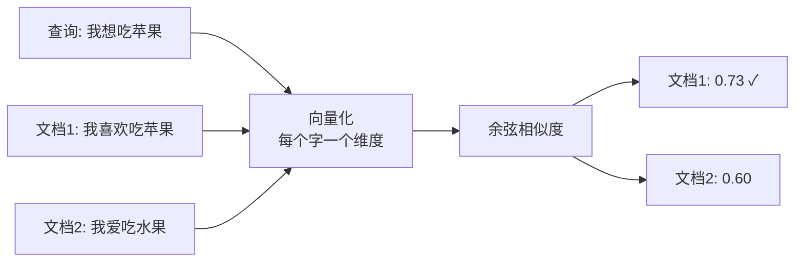

看起来挺合理。直到老师（AI）追问：**"如果把'苹果'换成'香蕉'，相似度多少？"**

我答 0.73。错了，应该是 0.36 —— 因为词袋模型只看共现的字数，"苹果"和"香蕉"在词面上**毫无关系**，它根本不知道两者都是水果。

> 这个被打脸的瞬间，我才意识到 RAG 的"检索"两个字含金量比我想的高得多。
> "搜索"在传统认知里是"关键字匹配"，但 RAG 里的检索要的是**语义相似** —— 这是两件完全不同的事情。

词袋模型的核心局限：

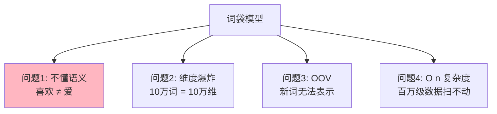

后面 5 节课，本质上都是在解决这 4 个问题中的某一个。

---

## 2. 让我重新理解"检索"这个词

### 2.1 词嵌入：让"喜欢"和"爱"靠近

Lesson 2 学的是**词嵌入（Word Embedding）**。直觉上是这样的：

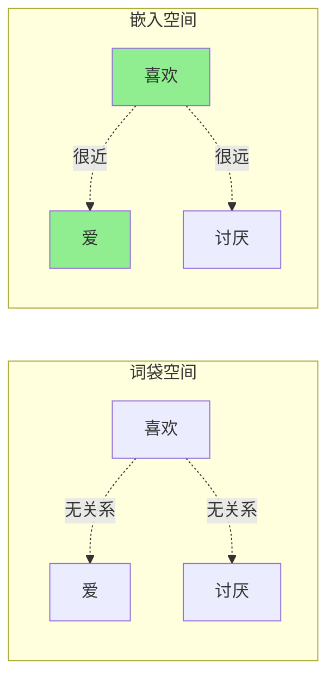

模型（Word2Vec / BERT / sentence-transformers）通过大量语料学习到："喜欢"和"爱"在语境中经常出现在相似的位置（**分布式假设**），所以它们的向量被拉近。

**对我来说最反直觉的事情**：embedding 没有教过任何"近义词词典"，它只是看了海量句子。但模型自动从中"悟"出了语义。

我用的是 `paraphrase-multilingual-MiniLM-L12-v2`，**384 维**就能编码一句话的语义。从词袋的 10 万维稀疏向量到 384 维稠密向量，问题 ②（维度爆炸）解决了。

### 2.2 FAISS：让百万文档秒级检索

Lesson 3 解决的是问题 ④（速度）。

朴素方案：每来一个 query 就跟所有文档算相似度。文档 100 万、维度 384 → 单次查询要 4 亿次浮点运算 → 大约 10 秒。**生产不可用**。

FAISS（Facebook AI Similarity Search）的思路用一句话讲：**先粗筛，再细比**。

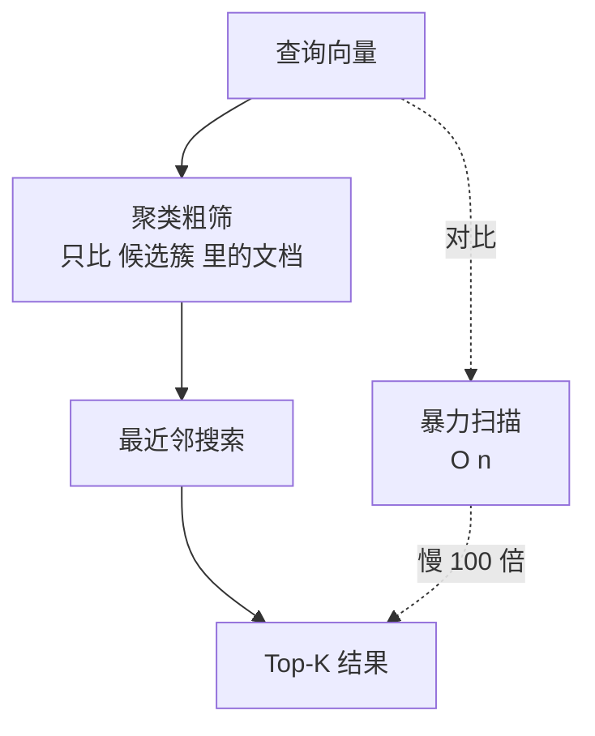

**但我的 demo 实际用的是 `IndexFlatL2`**，也就是暴力扫描 —— 因为我数据量才几千，根本到不了 IVF/HNSW 该上场的规模。

不过我后来做了两件让 demo 更"工程化"的事：

1. **从纯 in-memory FAISS 升级到了 Chroma**（底层默认走 HNSW，暴露 collection / metadata filter 接口，是真正的"向量数据库"，不只是单个 index 文件）
2. **加了持久化**（Chroma 自动落盘到 SQLite + parquet）：第二次启动直接从磁盘 load，跳过 embedding 计算

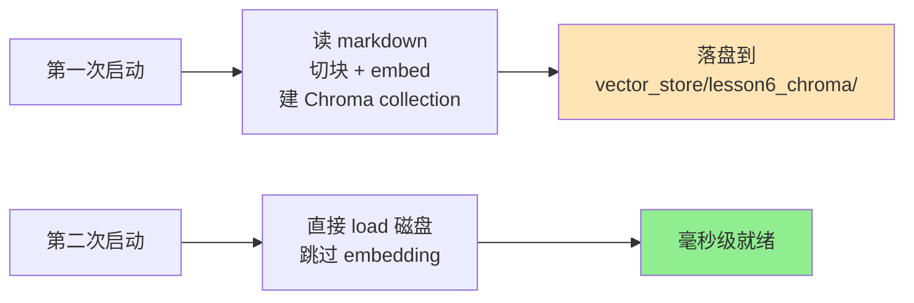

这两件事让我体感到一个工程现实：**生产 RAG 真正卡的不是"算法快不快"，而是"索引能不能不重建"**。embedding 一份文档的成本是稳定的，但不能让用户每次启动都等几十秒。

> 这是我学完 Lesson 3 后留的第一个"还没吃透"的问题：HNSW 的图结构具体怎么做到亚线性检索？我现在只懂"小世界图 + 多层跳跃"这层叙述，公式细节没追下去。后面 Lesson 8 打算专门刨。

---

## 3. 让检索"变准"的三件套

到这里检索已经能跑了，但**准不准是另一回事**。

Lesson 4-5 + 我的 demo 实战，让我意识到：从"能检索"到"检索得准"，中间有三件套：

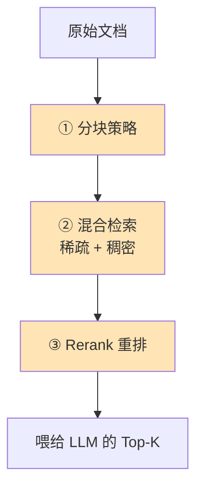

### 3.1 分块：太大噪声多，太小语义碎

我一开始觉得 chunk_size 不就是个数字，调一下就完了。**做完参数实验我才发现**：

| chunk_size | 体感 |
|---|---|
| 太小（<200） | 单块语义不完整，检索结果是"碎片" |
| 太大（>1000） | 一个块里混进无关信息，向量被稀释 |
| 适中（300-500） | 当前数据下表现最稳 |

但说实话，**我没在大数据集上验证过这个区间是否普适**。可能换一种文档（代码 vs 散文 vs 论文），最优区间会大不一样。这是第二个我没吃透的点。

`chunk_overlap` 是另一个关键，它的存在是为了避免一个完整的句子被切两半导致语义丢失。

### 3.2 混合检索：稀疏抓字面、稠密抓语义

我 demo 里的检索器是 **BM25 + FAISS 向量** 双路召回，然后用 **RRF（Reciprocal Rank Fusion）** 融合：

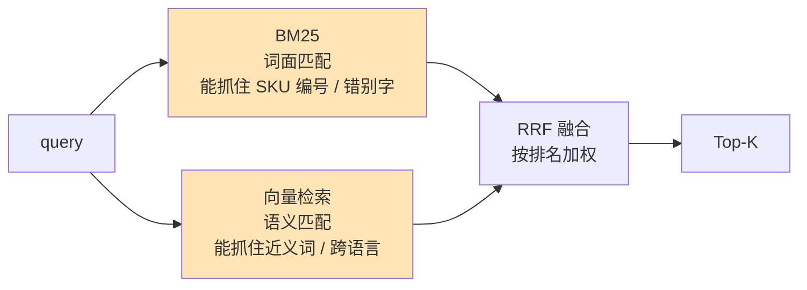

**为什么需要混合？** 单纯向量检索有个问题：当 query 里包含**专有名词、错别字、产品代号**这种"字面信息"时，向量化后这些字面特征反而会被稀释。BM25 这种"词面级匹配"反而准。

举个体感：用户搜 "iPhone 15 Pro"，向量检索可能给出"苹果手机评测"（语义相关但不准），BM25 会精确命中含有 "iPhone 15 Pro" 字符串的文档。两条路互补。

### 3.3 Rerank：召回后的精排

到这一步还有最后一道：**Cross-encoder 重排**。

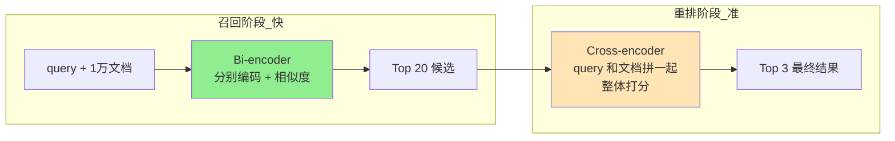

Bi-encoder 和 Cross-encoder 的区别我现在的理解是：
- **Bi-encoder**：query 和文档**分别**编码成向量，用余弦相似度打分。**快，可预计算**。
- **Cross-encoder**：query 和文档**拼接**后整体过模型，输出一个相关性分数。**慢，但准**。

所以工程上是"Bi-encoder 召回粗筛 + Cross-encoder 精排"的组合 —— 既要速度也要准度。

我 demo 用的是 `bge-reranker-base`（本地模型，约 1.1 GB）。

> 但我**没做 ablation**：单独看 BM25 / 向量 / Rerank 各自贡献多少分。这是我没吃透的另一件事。
> 真正的工程师做这种选型，会用 ablation 算清楚每个组件 ROI。我目前是"全开 + 体感跑分"。

---

## 4. 接上 LLM 那一刻：从 f-string 到 LCEL

到这一节才算完整 RAG。前面所有努力都是为了**给 LLM 端上一份相关性高、噪声低的上下文**。

我做了一个**渐进式三阶段**对比，写到同一个脚本里（[`lessons/lesson6/lesson6_langchain_generation.py`](#)）：

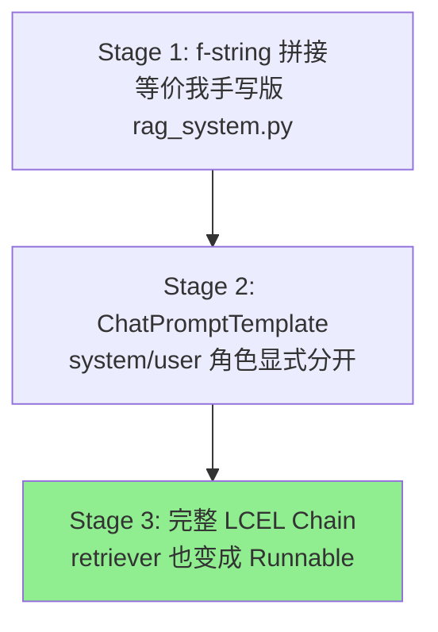

### 4.1 Stage 1：朴素拼接

```python
prompt = f"""基于以下上下文回答问题。如果上下文中没有相关信息，请说明无法回答。

上下文：
{context}

问题：{question}

回答："""
response = llm.invoke(prompt)
```

能跑。但隐患不少：prompt injection、变量混乱、改 prompt 等于改代码、看不到真实发出去的内容。

### 4.2 Stage 2：PromptTemplate 解决"结构化"

```python
prompt = ChatPromptTemplate.from_messages([
    ("system", "你是一个 RAG 助手..."),
    ("user", "上下文：\n{context}\n\n问题：{question}"),
])
chain = prompt | llm
```

system / user 角色显式分开，符合 ChatGPT/GLM 真实接口；变量声明化、可序列化、可组合。

### 4.3 Stage 3：完整 LCEL Chain

```python
chain = (
    {
        "context": RunnableLambda(retrieve) | RunnableLambda(format_docs),
        "question": RunnablePassthrough(),
    }
    | prompt
    | llm
    | StrOutputParser()
)
chain.invoke(question)
```

**这里我才搞懂 LCEL 真正的价值**。它不是"代码更短"，而是**免费拿到流式 / 批量 / 异步 / 可观测**这些工程能力：

| 能力 | 手写版 | LCEL 版 |
|---|---|---|
| 流式输出 | 自己写 | `chain.stream()` 一行 |
| 批量 | 自己写 | `chain.batch([...])` 一行 |
| 异步 | 自己写 | `chain.ainvoke()` 一行 |
| 单步调试 | 加 print | 每个 Runnable 可单独 invoke |
| LangSmith trace | 不支持 | 自动 |

> **我对 LangChain 的态度也是这一节才转变的**：之前看它觉得"这不就是包装，背后还是那套"，确实没错。但当你已经手写过一遍底层后再看 LCEL，会承认它是**降低工程化门槛的好抽象**。

### 4.4 Stage 1 vs Stage 2 实战对比

同一个问题、同一份检索结果，stage 1（朴素 f-string）和 stage 2（ChatPromptTemplate）的输出差异 ——

**问题**：为什么不推荐使用 `git add .` 来提交代码？

**Stage 1 输出（朴素 f-string）**：

```text
不推荐使用 `git add .` 的原因主要有以下几点：

1. 容易把无关文件一起提交
   `git add .` 会把工作区当前目录下的所有改动全部加入暂存区...
2. 可能误提交敏感或不必要的内容
   有时会不经意地把本地的配置文件、缓存文件、调试代码等加入提交...
3. 降低提交的可读性和可追溯性
   当一次提交里混入了大量无关改动，审阅者在查看 commit message 时...
4. 违背"显式"的原则
   明确指定要提交的文件 `git add <file>` 能让开发者...

综上，为了保持提交的干净、可控和易于审阅，建议使用明确的 `git add <文件>`...
```

**Stage 2 输出（ChatPromptTemplate）**：

```text
不推荐在提交前直接使用 `git add .`，主要有以下原因：

- 容易把无关文件一起提交：`git add .` 会把当前目录下的所有变化都加入暂存区...
- 可能误提交配置、缓存或调试文件：这些文件往往只在本地有效...

因此，推荐在提交前明确指定要添加的文件（例如 `git add <文件>`），并使用
`git diff --staged` 查看已暂存的改动，确保只提交真正需要的内容【来源1】。
```

**关键观察 —— stage 2 自己加了【来源1】，stage 1 没有**。

这不是模型变聪明了，是 stage 2 的 system message 多了一句 *"回答时尽量引用具体的来源编号（如[来源1]）"*。

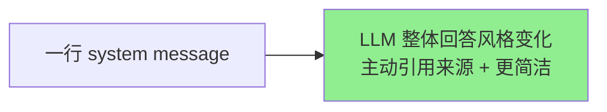

> **这就是结构化 prompt 真正的价值** —— 不在"代码更短"，在你能用 system message **稳定地塑形 LLM 的输出风格**。换成 f-string 你也能加这句话，但 prompt 一变长就乱、prompt injection 风险也来了。

> stage 3 的 LLM 输出和 stage 2 几乎一致（用的是同一份 prompt），差别在外层工程能力（流式 / 批量 / 异步），见上节表格。

### 4.5 多模型对比：选型直觉的训练

我用的是 OpenAI-compatible 聚合网关（rosmontis），**一个 key 通了 26 个模型**。改一个环境变量就能切 LLM，业务代码不动 —— 这正是"OpenAI-compatible 协议"作为事实标准的工程红利。

让脚本同一份检索结果依次喂给 5 个模型，**回答差异肉眼可见**：

**[1/5] gpt-oss-120b** —— 最稳，详尽 + 引用 + 解决方案

```text
不推荐使用 `git add .` 的原因主要有两点：

1. 容易一次性把无关文件一起加入暂存区——这样会把配置文件、本地缓存、
   调试代码等不该提交的内容一起提交进去【来源1】。
2. 缺少提交前的检查——直接 `git add .` 后直接提交，往往没有机会审视
   哪些文件真正被纳入本次变更...

更安全的做法是显式指定要添加的文件（如 `git add <文件>`），并在提交前
使用 `git diff --staged` 查看暂存区的差异【来源1】。
```

**[2/5] glm-5-turbo** —— 最简略，几乎照抄原文

```text
不推荐使用 `git add .` 来提交代码的原因是：
1. 容易把无关文件一起带上；
2. 可能误提交配置、本地缓存、调试文件[来源1]。
```

**[4/5] kimi-k2.5** —— 最详尽，自己延伸出原文里没有的合理推断

```text
不推荐直接使用 `git add .` 的主要原因是容易误提交无关或敏感文件。

1. 容易把无关文件一起带上
   使用 `git add .` 会将当前目录下所有修改过的文件（包括新文件）一次性
   加入暂存区，可能包含本应忽略的临时文件、日志或测试数据。

2. 可能误提交配置、本地缓存、调试文件
   例如本地开发配置（`.env`、IDE 配置）、缓存文件或调试过程中生成的
   临时文件...

这样可以避免因误提交导致的敏感信息泄露、仓库体积膨胀或 CI/CD 流程异常
等问题。
```

**对比汇总**：

| 模型 | 体感 | 风险 |
|---|---|---|
| gpt-oss-120b | 详尽 + 来源准确 + 给解决方案 | 中规中矩 |
| glm-5-turbo | 几乎照抄原文 | "读得不细"，没提炼 |
| glm-5.1 | 简短 + 引用 + 有解决方案 | 中规中矩 |
| kimi-k2.5 | 自动延伸（敏感信息泄露 / 仓库膨胀 / CI/CD 异常） | **过度发挥风险** —— 同样的扩展力换个场景可能就是 hallucination |
| qwen3.5-397b-a17b | 结构清晰 + 引用准确 | 没特别亮点 |

**这一节我学到的最有用的事**：

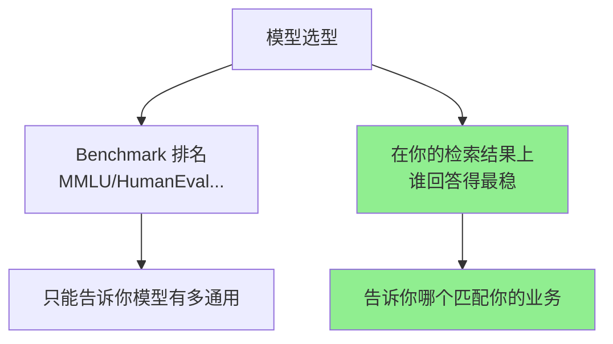

---

## 5. Vibe Coding 心得：AI 协作里我学到了什么

这个 demo 不是我从零敲出来的，是我跟 Claude Code 一起 vibe coding 出来的。这个事实摊开讲，因为它是这段时间最大的**元收获**。

### 5.1 AI 帮我做了什么

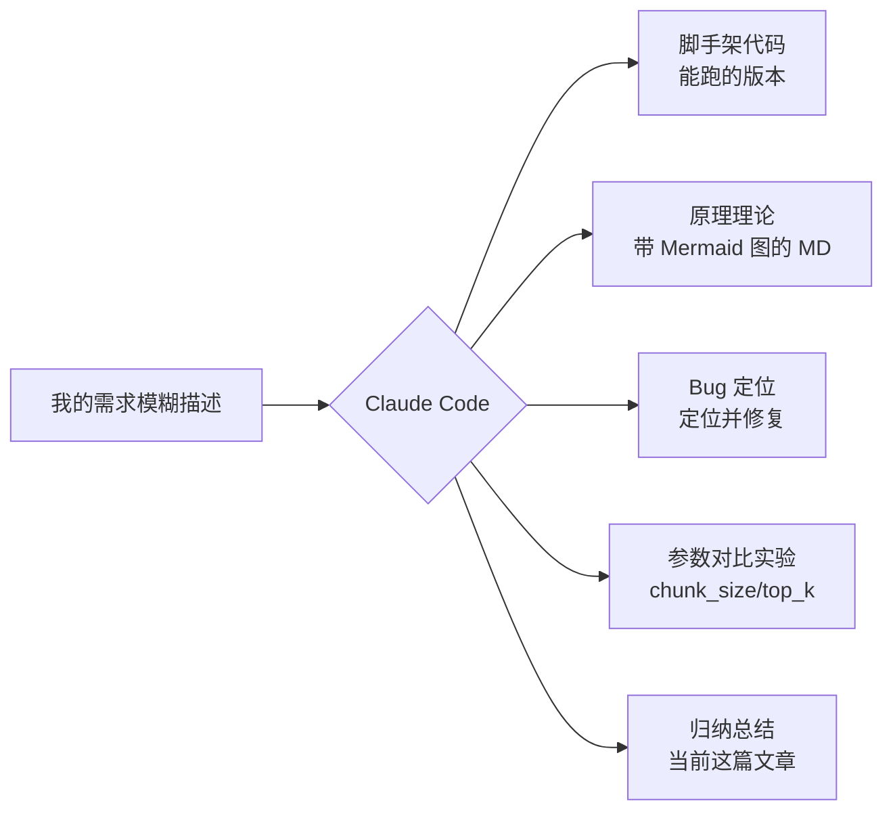

最大的加速：**理论 → 代码 → 实验 → 结论** 这条链路从过去的"几天"压到了"几小时"。

### 5.2 AI 没替我做的事（也是最重要的）

但有几件事，AI **不会主动替你做**，而你必须做：

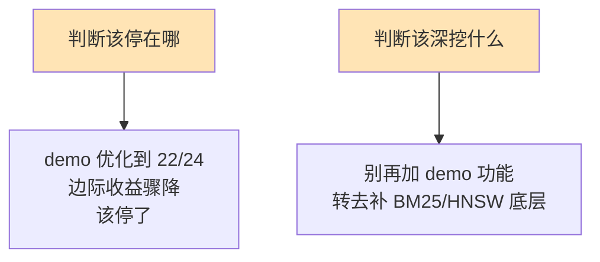

**AI 太"配合"了**。你说"再帮我加个功能"它就帮你加。但**真正决定项目价值的是知道什么时候停**，这个判断必须你自己做。

我自己摸出来的做法是：每次跟 AI 做完一件事强制自己做三件事，让自己不至于"看完就忘" ——

1. **复述**：用自己的话把刚才做的讲一遍（不能复制 AI 的话）
2. **质疑**：为什么这么做、有没有别的方案、AI 推荐的真的最优吗
3. **改造**：自己手动改一处（哪怕只是改个变量名），强迫自己读懂

不然 AI 写得越快，你忘得越快 —— 这是这两周做 RAG demo 时最直接的体感。

### 5.3 一个具体例子

我 demo 的 hybrid retrieval 跑 24 题评测，第一版 19/24，调了几轮到 22/24，然后我跟 AI 说"还能继续优化吗"。AI 给了一堆方案：query 改写、HyDE、Self-RAG、Multi-query……

**这时候我没继续**。因为我意识到：
- 没有真实业务约束（不是给客户做的，是练手）
- 测试集就 24 题（继续调可能是过拟合）
- 边际收益骤降（19→22 容易，22→23 要付出 10 倍代价）

**这个停下来的判断，AI 不会替我做**。它只会给方案，不会说"该停了"。

---

## 6. 一张图看完整 RAG 全景

学了两周，如果只能留一张图给我自己，是这张：

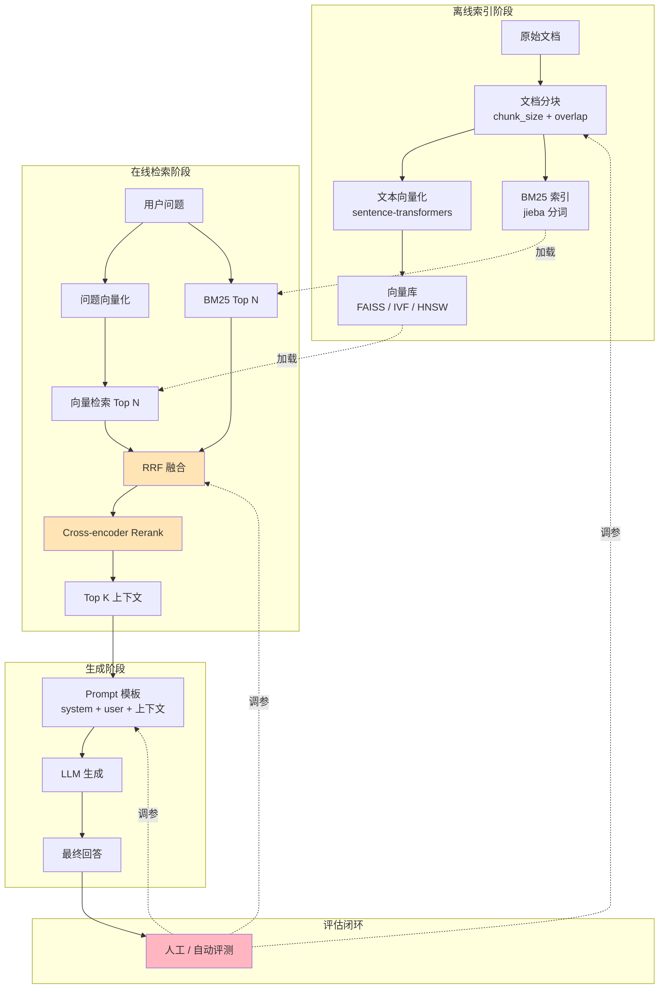

**每一个方块都对应一个具体的技术决策点**，能展开讲清楚的方块越多，说明对 RAG 的理解越完整。

---

## 7. 还想往下挖什么

这两周是"扫一遍 + 做出 demo"，但有几个地方我自己心里清楚还没吃透：

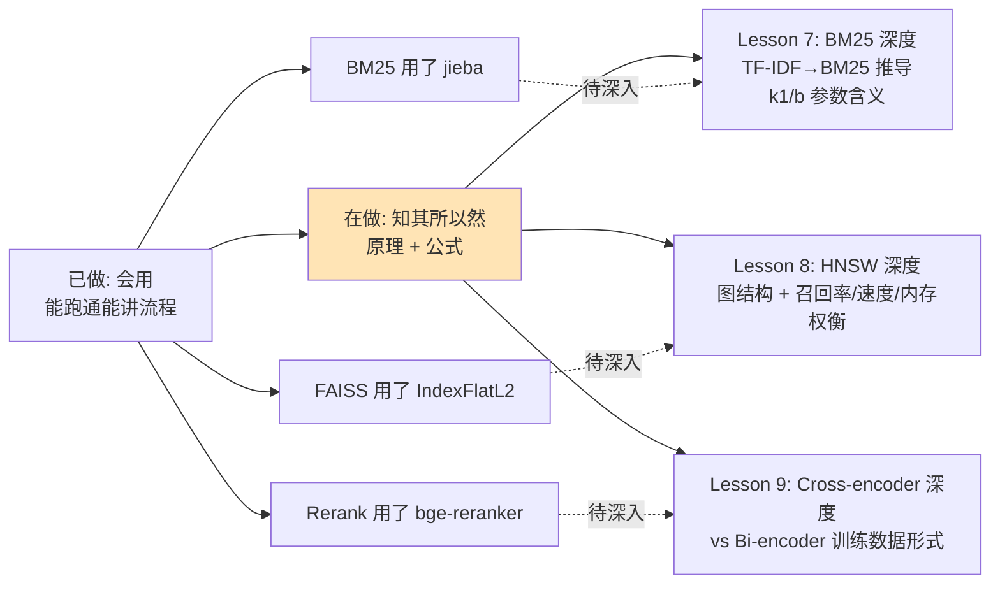

**为什么按这个顺序**：这三个组件在 demo 里都用过了，但只到"知道用哪个 API"层级，原理不通的话稍微深问就露馅。继续往上叠新框架不如先把这三个底层补透。

---

## 8. 最后

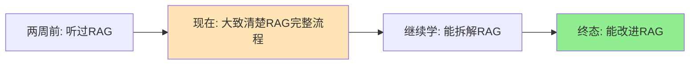

我现在在 B → C 这一段。这篇博客是 B 的产出物，也是给自己一个交代 —— **每学一件事必须有可见输出**，不然就是在消费自己的时间。

**已知不足，欢迎拍砖**：

- ① 词袋 / 词嵌入 / FAISS 的内部细节，我目前是叙述层面理解，公式级别还没追
- ② 分块策略我没在大数据集 + 多文档类型上验证过普适性
- ③ Hybrid retrieval 的 RRF / 各组件贡献我没做 ablation
- ④ HNSW 的图结构 + 多层跳跃机制，我只懂"小世界图"这层叙述
- ⑤ Cross-encoder 训练数据形式（query-doc-label triplet）只是听过，没真实训过
- ⑥ 现在用的是 Chroma 单机持久化，**没玩过分布式向量库**（Milvus / Qdrant cluster），生产侧的"分片 / 副本 / 一致性"完全没碰过

如果你看到这里，欢迎在评论区告诉我"你这里讲偏了"。我会更新这篇文章，把它当成自己的学习追踪。

---

## 附：代码与材料

- 项目代码：之后整理上 GitHub（todo）
- 关键脚本：
  - `rag_system.py` —— 手写版完整 RAG 编排
  - `lessons/lesson6/lesson6_langchain_retrieval.py` —— Hybrid + Rerank 的 LangChain 版
  - `lessons/lesson6/lesson6_langchain_generation.py` —— 接 LLM 生成（3 stage + 多模型对比）
- 评测脚本：`demo/eval_run.py`（24 题自动评测）
- 6 篇 Lesson 理论笔记：`lessons/lesson*/LESSON*_THEORY.md`
