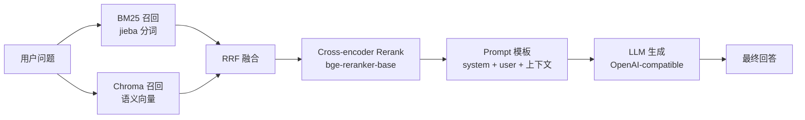
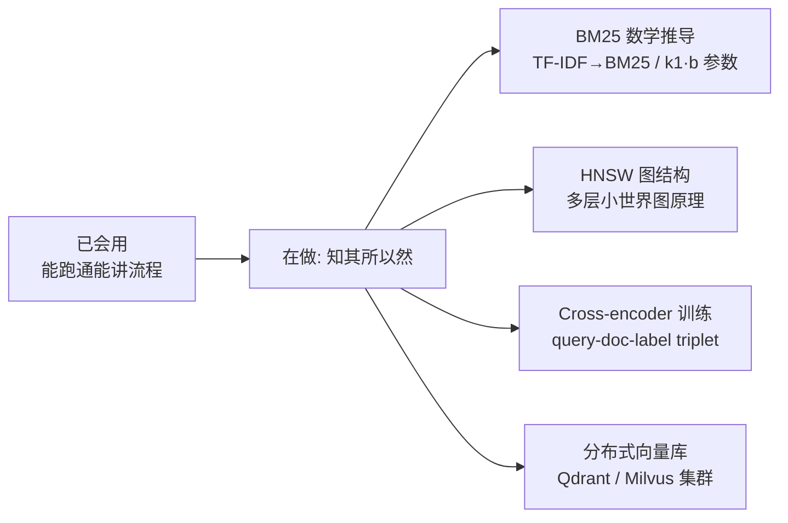

# 两周浅学 RAG：vibe coding 了一个 demo，请大佬指教

这个仓库是博客 [**《两周浅学 RAG》**](https://juejin.cn/post/7634584510009524276) 的配套代码。

不是教程，是"我学完两周后的理解快照"。有哪里讲偏了或者有待提高的，欢迎在博客评论区留言。

---

## 仓库内容

```
RAG/
├── BLOG_两周浅学RAG.md          # 博客主体（4500 字 + 13 张 Mermaid 图）
├── lessons/                    # 6 节课的理论 MD + 教学脚本
│   ├── lesson1/                #   词袋模型 + 余弦相似度
│   ├── lesson2/                #   词嵌入 / Word2Vec / BERT
│   ├── lesson3/                #   FAISS 向量检索
│   ├── lesson4/                #   文档分块策略
│   ├── lesson5/                #   评估与优化
│   └── lesson6/                #   LangChain 重写 + LCEL + 多模型对比（博客主线 demo）
├── data/                       # 公开数据（git 操作规范文档）
├── config.py                   # 配置（chunk_size / top_k / 模型路径）
├── requirements.txt
└── .env.example
```

每个 Lesson 在 `lessons/lessonN/LESSONN_THEORY.md` 里有理论说明，讲的就是博客对应章节的底层。

---

## 快速开始

### 1. 装依赖

```bash
python -m venv venv
source venv/Scripts/activate     # Windows Git Bash
# 或 source venv/bin/activate    # Linux / macOS
pip install -r requirements.txt
```

> 第一次跑会从 HuggingFace 下载 embedding 模型（约 400MB）+ bge-reranker-base（约 1.1GB），大约 5-10 分钟。

### 2. 跑 demo

```bash
# 完整 RAG demo（检索 + LLM 生成）—— 首次跑会建 Chroma 索引并落盘
python lessons/lesson6/lesson6_langchain_generation.py --stage 2

# 第二次起会从磁盘 load，秒载
python lessons/lesson6/lesson6_langchain_generation.py --stage 2

# 多模型对比（同一份检索结果依次喂给多个模型，肉眼看差异）
python lessons/lesson6/lesson6_langchain_generation.py --compare

# 强制重建索引（换了数据 / 改了分块参数后用）
python lessons/lesson6/lesson6_langchain_generation.py --rebuild

# 换问题
python lessons/lesson6/lesson6_langchain_generation.py --question "提交前怎么避免误暂存？"
```

---

## demo 架构



完整链路 + 选型理由见博客 [《两周浅学 RAG》](https://juejin.cn/post/7634584510009524276)。

---

## 关键技术选型

| 组件 | 选型 | 一句话理由 |
|---|---|---|
| 分块 | 语义分块（markdown section + 句向量相似度） | 比固定窗口分块更尊重原文结构 |
| 向量库 | **Chroma**（持久化） | 真正的"向量数据库"接口，不只是 index 文件；pip 一行装好 |
| Embedding | `paraphrase-multilingual-MiniLM-L12-v2` | 384 维，支持中文 |
| 召回 | BM25（jieba）+ 向量 双路 | 字面 + 语义互补 |
| 融合 | RRF（Reciprocal Rank Fusion） | 基于排名而非原始分数，跨检索器更鲁棒 |
| 重排 | `bge-reranker-base`（Cross-encoder） | 精排比 Bi-encoder 准 |
| LLM 接口 | OpenAI-compatible | 一份代码切多家厂商 |
| 工程化 | LangChain LCEL | 免费拿到流式 / 批量 / 异步 / 可观测 |

---

## 配置参数

改 `config.py`：

- `CHUNK_SIZE` / `CHUNK_OVERLAP`：分块策略
- `TOP_K`：检索返回数
- `EMBEDDING_MODEL`：embedding 模型名
- `RERANK_MODEL`：rerank 模型路径（自动用本地 `model/` 下的，没有则从 HuggingFace 拉）
- `LESSON6_CHROMA_ROOT`：Chroma 持久化根目录（默认 `vector_store/lesson6_chroma/`）

---

## 还想往下挖什么（TODO）



详见博客第 7 节"还想往下挖什么"。

---

## 常见问题

**Q: 第一次跑很慢？**
A: 下载模型 + 切块 + 计算 embedding。第二次起会从 Chroma 磁盘 load，秒载。

**Q: 跑出 403 "Your request was blocked"？**
A: 第三方 OpenAI-compatible 网关会用 WAF 拦截官方 SDK 特征 header。`lesson6_langchain_generation.py:build_llm` 已经写了绕过修法（覆盖 `User-Agent` + 清空 `x-stainless-*`）。

**Q: 想换自己的数据？**
A: `--file path/to/your.md`，会自动用文件名 stem 作为 collection name 建独立索引，不会跟原数据串味。

**Q: 怎么知道 Chroma 真的持久化了？**
A: 第一次跑后看 `vector_store/lesson6_chroma/<file_stem>/` 目录，有 `chroma.sqlite3` + `chunks.pkl` 就对了。第二次跑日志里会看到 `[缓存] 从 ... 加载已有索引...`。

---

## License

todo（写本仓库前补）
