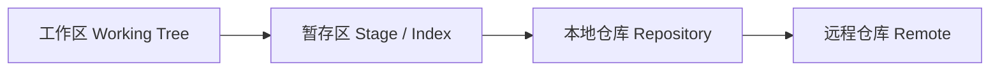
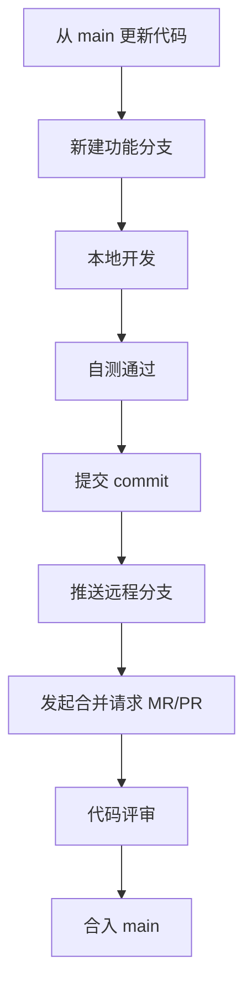
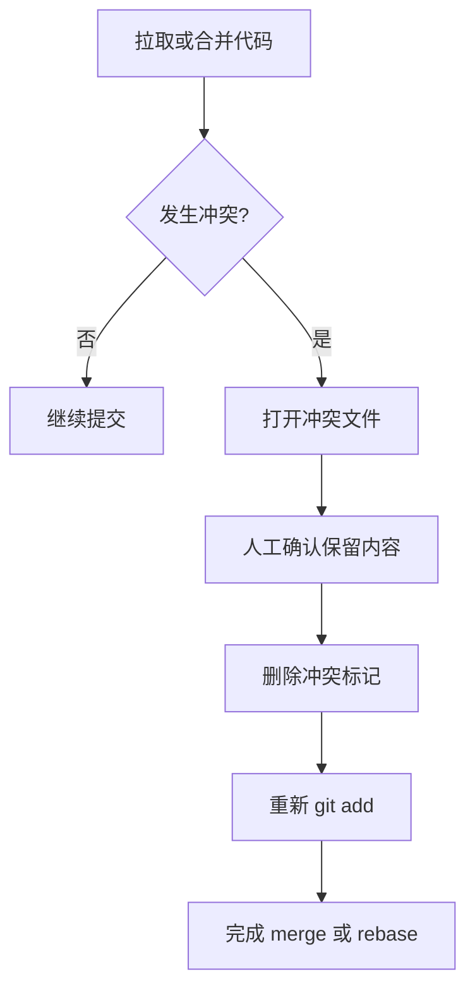

# 我司 Git 的操作规范文档

## 一、为什么要统一 Git 规范

Git 不只是一个代码版本管理工具，它也是团队协作的基础设施。

在个人开发时，Git 主要用来：
- 保存历史版本
- 回退错误修改
- 管理不同功能分支

在团队协作时，Git 更重要的作用是：
- 让多人并行开发时不互相覆盖代码
- 让代码评审（Code Review）有统一的上下文
- 让发布、回滚、排查问题更可追踪
- 让提交记录成为长期可复用的项目知识

如果没有统一规范，常见问题会很多：
- 分支名混乱，看不出用途
- commit message 随意，后续无法快速定位变更原因
- 一次提交改动过多，review 困难
- 频繁直接提交主分支，增加线上风险
- 遇到冲突时操作不规范，容易覆盖他人代码

所以这份文档的目标不是“教会 Git 命令”，而是建立一套适合团队协作的 Git 工作方式。

---

## 二、Git 的基本概念

### 1. 工作区、暂存区、版本库



- **工作区**：你正在编辑的文件
- **暂存区**：准备提交的文件集合
- **本地仓库**：本机上的提交历史
- **远程仓库**：例如 GitLab / GitHub / 企业代码平台上的仓库

### 2. 分支是什么

分支可以理解为一条独立的开发线。

常见分支类型：
- `main`：主分支，通常对应可发布状态
- `develop`：开发主线（如果团队采用）
- `feature/*`：新功能开发
- `bugfix/*`：缺陷修复
- `hotfix/*`：线上紧急修复
- `release/*`：发版准备分支

### 3. commit 是什么

一次 `commit` 就是一次有边界的变更记录。

一个好的 commit 应该满足：
- 主题单一
- 改动可解释
- 可 review
- 可回滚

也就是说：**一个 commit 最好只表达一件事。**

---

## 三、最常用 Git 命令

## 1. 初始化与拉取

```bash
git clone <仓库地址>
git pull origin main
```

- `git clone`：把远程仓库拉到本地
- `git pull origin main`：拉取远程 `main` 最新代码并合并到当前分支

## 2. 查看状态

```bash
git status
git log --oneline --graph --decorate -10
git diff
git diff --staged
```

- `git status`：查看文件修改状态
- `git log --oneline --graph --decorate -10`：查看最近提交历史
- `git diff`：查看未暂存修改
- `git diff --staged`：查看已暂存但未提交的修改

## 3. 新建与切换分支

```bash
git checkout -b feature/user-login
git switch -c feature/user-login
git switch main
```

说明：
- 新版本 Git 推荐优先使用 `git switch`
- 老命令 `git checkout` 仍然常见，但语义更混杂

## 4. 添加与提交

```bash
git add <文件名>
git add src/app.py src/utils.py
git commit -m "feat(auth): add login form validation"
```

规范建议：
- 优先 `git add` 指定文件，不要习惯性 `git add .`
- 提交前先看 `git diff --staged`
- 确认没有把无关文件、敏感文件、临时文件一起提交

## 5. 推送代码

```bash
git push origin feature/user-login
```

第一次推送新分支常用：

```bash
git push -u origin feature/user-login
```

含义：
- `-u` 会建立本地分支和远程分支的跟踪关系
- 后续可以直接使用 `git push` / `git pull`

## 6. 合并与变基

```bash
git merge main
git rebase main
```

- `merge`：保留分叉历史，适合保留完整上下文
- `rebase`：让提交历史更线性，但对初学者更容易出错

团队建议：
- 如果你不熟悉 `rebase`，优先使用 `merge`
- 如果团队要求线性历史，再按团队规范使用 `rebase`
- **不要对已经共享给他人的提交随意 rebase 后强推**

## 7. 撤销与回退

```bash
git restore <文件名>
git restore --staged <文件名>
git revert <commit-id>
```

说明：
- `git restore <文件名>`：撤销工作区修改
- `git restore --staged <文件名>`：把文件从暂存区撤回工作区
- `git revert <commit-id>`：通过新增一个反向提交来撤销历史提交，适合共享分支

谨慎使用：

```bash
git reset --hard <commit-id>
```

`reset --hard` 会直接丢弃本地修改，除非明确知道后果，否则不要使用。

---

## 四、我司推荐的日常开发流程



标准流程如下：

1. 切到主分支并更新最新代码
2. 基于主分支新建功能分支
3. 在功能分支上开发，不直接改 `main`
4. 自测通过后再提交
5. 推送到远程并发起 MR/PR
6. 通过 review 后合并

推荐命令：

```bash
git switch main
git pull origin main
git switch -c feature/1234-user-login
git add src/auth/login.py
git commit -m "feat(auth): add login flow"
git push -u origin feature/1234-user-login
```

---

## 五、分支命名规范

分支名必须做到：
- 一眼看出用途
- 尽量和需求 / 缺陷单号关联
- 简洁，不要写整句

推荐格式：

```text
feature/<ticket>-<short-description>
bugfix/<ticket>-<short-description>
hotfix/<ticket>-<short-description>
release/<version>
chore/<short-description>
```

示例：

```text
feature/1234-user-login
feature/2387-rag-file-upload
bugfix/4567-fix-token-refresh
hotfix/8899-fix-payment-timeout
release/v1.8.0
chore/update-ci-cache
```

命名要求：
- 小写字母
- 单词之间用 `-` 分隔
- 不要用中文、空格、特殊符号
- 尽量带上工单号或任务号

不推荐的命名：

```text
test
mybranch
zhangsan
fix
new-code
临时分支
```

这些名字的问题是：
- 看不出业务含义
- 无法追踪来源
- 难以长期维护

---

## 六、提交信息（Commit Message）规范

提交信息不是给 Git 看的，是给团队看的。

一个好的 commit message 应该让别人快速理解：
- 这次改了什么
- 属于哪类改动
- 影响哪个模块

### 1. 推荐格式

```text
<type>(<scope>): <subject>
```

示例：

```text
feat(auth): add login flow
fix(order): handle empty order id
refactor(rag): simplify vector store init
docs(git): add branch naming guide
test(api): add coverage for token refresh
chore(ci): update cache strategy
```

### 2. type 含义

| type | 含义 |
|---|---|
| `feat` | 新功能 |
| `fix` | 修复缺陷 |
| `refactor` | 重构，不改变外部功能 |
| `docs` | 文档修改 |
| `test` | 测试相关 |
| `chore` | 构建、脚手架、依赖、配置等杂项 |
| `perf` | 性能优化 |
| `style` | 纯格式调整，不改逻辑 |
| `build` | 构建系统或依赖打包修改 |
| `ci` | CI/CD 配置修改 |
| `revert` | 回滚某次提交 |

### 3. subject 编写要求

- 用动词开头
- 简洁明确
- 不要写成流水账
- 不要加句号
- 一般控制在 50 字符左右更好

推荐：

```text
fix(auth): prevent duplicate login request
feat(search): support tag filter
```

不推荐：

```text
update code
fix bug
修改一下登录逻辑
final version
临时提交
```

### 4. 我司额外要求

如果团队有工单系统，建议在分支名中带工单号；如有需要，也可在 commit body 中补充背景：

```text
feat(rag): support markdown file ingestion

Why:
用户知识库开始接入 Markdown 文档，需要统一进入检索流程。
```

### 5. 一次提交的粒度要求

一个 commit 最好只做一类事情，例如：
- 一个 commit 改功能
- 一个 commit 补测试
- 一个 commit 改文档

不要把这些混在一个 commit 里：
- 改登录逻辑
- 顺手改了 20 个格式文件
- 再加一个不相关的依赖升级

这样会让 review 和回滚都变得困难。

---

## 七、Pull Request / Merge Request 规范

发起 PR / MR 时，需要让 reviewer 快速知道变更价值和风险。

推荐结构：

### 标题

标题建议和主 commit 风格一致，简短明确。

例如：

```text
feat(auth): add login flow validation
```

### 描述模板

```markdown
## 变更内容
- 新增登录表单校验
- 统一错误提示文案
- 补充登录流程单元测试

## 变更原因
- 避免空密码和非法邮箱进入后端
- 降低登录失败排查成本

## 测试情况
- [x] 本地自测通过
- [x] 单元测试通过
- [ ] 联调完成

## 风险说明
- 影响登录页表单提交流程
- 不涉及数据库结构变更
```

### PR / MR 要求

- 描述里要写清楚变更范围
- 如果涉及 UI，最好附截图
- 如果涉及接口，最好注明影响点
- 如果涉及数据库，必须强调迁移风险
- 如果有回滚方案，最好写清楚

---

## 八、哪些操作是禁止或强烈不推荐的

### 1. 直接在 `main` 上开发

除非极特殊情况，否则不允许直接在 `main` 上提交业务代码。

### 2. 强推共享分支

```bash
git push --force
```

对共享分支强推会改写历史，容易影响其他同事。

只有在以下条件同时满足时才允许：
- 这是你自己的临时分支
- 没有其他人基于这个分支协作
- 你明确知道自己在做什么

### 3. 提交敏感信息

严禁提交以下内容：
- 密码
- Token
- Access Key / Secret Key
- 数据库连接串
- 私钥文件
- 客户数据导出文件

提交前要重点检查：

```bash
git status
git diff --staged
```

### 4. 用“临时提交”污染历史

例如：

```text
tmp
test
save
wip
final fix
```

这些提交会严重降低历史可读性。

如果代码未完成，建议：
- 先本地保留，不急着提交
- 或在个人分支中使用更清晰的说明
- 合并前整理提交历史

---

## 九、常见场景操作示例

## 场景 1：开始开发一个新需求

```bash
git switch main
git pull origin main
git switch -c feature/1357-user-profile
git add src/profile/service.py
git commit -m "feat(profile): add user profile query"
git push -u origin feature/1357-user-profile
```

## 场景 2：修复一个线上问题

```bash
git switch main
git pull origin main
git switch -c hotfix/2468-fix-payment-timeout
git add src/payment/timeout.py
git commit -m "fix(payment): handle timeout retry"
git push -u origin hotfix/2468-fix-payment-timeout
```

## 场景 3：提交后发现漏了一个文件

```bash
git status
git add src/auth/token.py
git commit -m "fix(auth): include token refresh handler"
```

建议新增一个 commit，而不是盲目修改已共享历史。

## 场景 4：撤销某次已合入主分支的提交

```bash
git revert <commit-id>
```

适用原因：
- 不改写共享历史
- 团队协作更安全

---

## 十、冲突处理基本原则

发生冲突并不可怕，可怕的是不理解就乱操作。

### 1. 冲突通常发生在
- 你和别人改了同一段代码
- 你本地分支落后太久
- 合并或 rebase 时遇到同一文件差异

### 2. 基本处理流程



### 3. 冲突标记示例

```text
<<<<<<< HEAD
当前分支内容
=======
待合并分支内容
>>>>>>> other-branch
```

处理原则：
- 不要机械地“全选自己”或“全选别人”
- 先理解业务意图，再决定保留哪部分
- 解决后一定重新测试受影响逻辑

---

## 十一、推荐的提交前检查清单

每次提交前，至少确认以下事项：

- [ ] 当前不在 `main` 分支上直接开发
- [ ] 只提交了和本次任务相关的文件
- [ ] 没有提交密钥、配置机密、临时文件
- [ ] `git diff --staged` 已检查
- [ ] 代码已经完成最基本自测
- [ ] commit message 符合规范
- [ ] 如果改动较大，已拆分成多个清晰 commit

---

## 十二、新人最容易犯的几个错误

### 错误 1：`git add .` 后直接提交

问题：
- 容易把无关文件一起带上
- 可能误提交配置、本地缓存、调试文件

更好的做法：
- 明确 `git add <文件>`
- 提交前看 `git diff --staged`

### 错误 2：把一个大需求压成一个 commit

问题：
- review 困难
- 回滚困难
- 很难定位哪部分引入了问题

更好的做法：
- 按功能点拆 commit
- 保持每个 commit 语义清晰

### 错误 3：不更新主线就开始开发

问题：
- 后续冲突增多
- 容易基于旧代码继续写，增加返工

更好的做法：
- 开始开发前先 `git pull origin main`

### 错误 4：乱用 `reset --hard` 和 `push --force`

问题：
- 容易丢代码
- 容易影响团队成员

更好的做法：
- 共享分支优先 `revert`
- 危险命令先确认后果再执行

---

## 十三、总结

统一 Git 规范的核心不是“命令记忆”，而是三件事：

1. **让协作可控**：分支清晰、流程稳定、避免互相覆盖
2. **让历史可读**：命名规范、提交规范、方便 review 和追溯
3. **让风险可管**：不直接改主分支、不乱强推、不提交敏感信息

如果你只记住一句话，请记住这句：

> Git 规范的本质，是让今天的你和未来的团队，都能看懂这次改动为什么存在。
