# 第三课：FAISS 向量存储（理论篇）

## 学习目标

- 理解向量检索的性能瓶颈
- 掌握 FAISS 的核心索引类型
- 理解准确率与速度的权衡
- 学会根据场景选择合适的索引

---

## 一、核心问题：为什么需要 FAISS？

### 1.1 暴力检索的性能问题

回顾前两课，我们的检索方法是：**逐个计算相似度，找出最高的**。

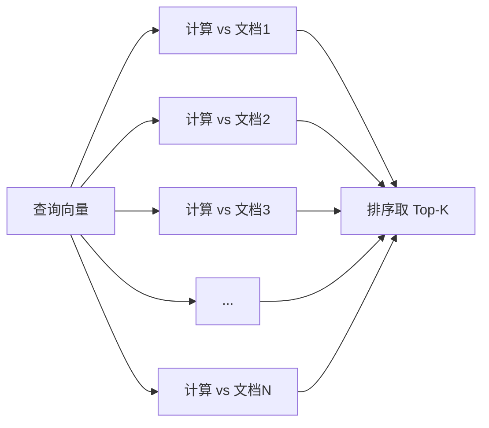

**时间复杂度**：O(n x d)，n=文档数，d=向量维度

| 文档数量 | 维度 | 耗时 | 能用吗？ |
|---------|------|------|---------|
| 1,000 | 384 | 0.01 秒 | 可以 |
| 10,000 | 384 | 0.1 秒 | 勉强 |
| 100,000 | 384 | 1 秒 | 太慢 |
| 1,000,000 | 384 | 10 秒 | 不可用 |

**问题本质**：每次查询都要遍历所有文档，文档越多越慢。

### 1.2 生活类比：找书

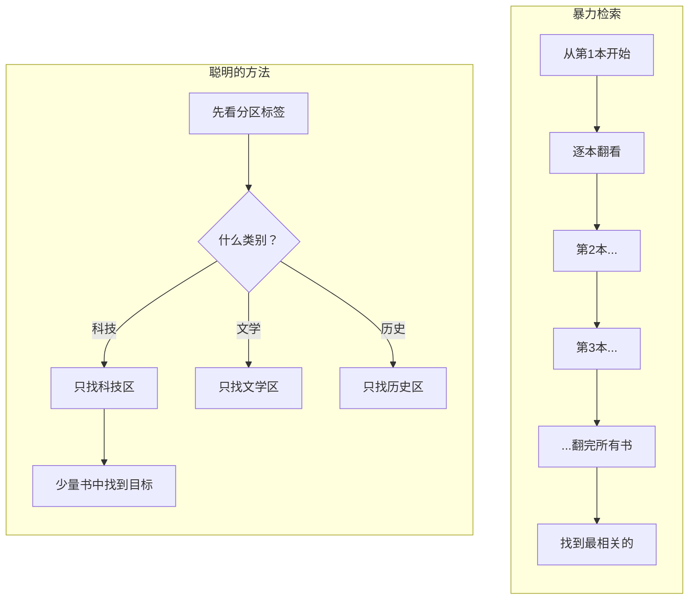

**FAISS 的核心思想就是"图书馆方法"**：
- 把向量空间分成多个区域
- 查询时只搜索最相关的几个区域
- 大幅减少计算量

---

## 二、精确搜索 vs 近似搜索

在讲具体索引之前，先理解一个关键概念：

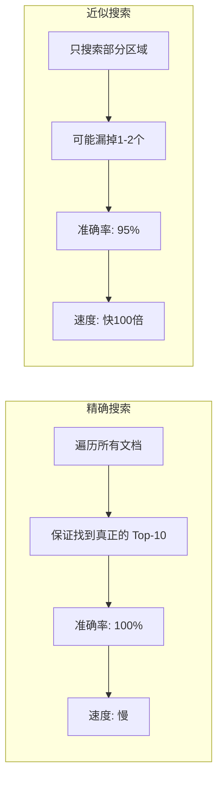

**关键洞察**：RAG 场景中，我们要的是"找到大致相关的文档"，不需要100%精确。

举个例子：
- 精确搜索找到的 Top-10：`[文档3, 文档7, 文档12, 文档5, ...]`
- 近似搜索找到的 Top-10：`[文档3, 文档7, 文档15, 文档5, ...]`
- 只有1个不同，但速度快了100倍
- 对 RAG 来说，这完全可以接受

---

## 三、FAISS 的三种核心索引

### 3.1 IndexFlatL2 —— 精确但慢

**原理**：就是暴力搜索，计算所有向量的 L2 距离。

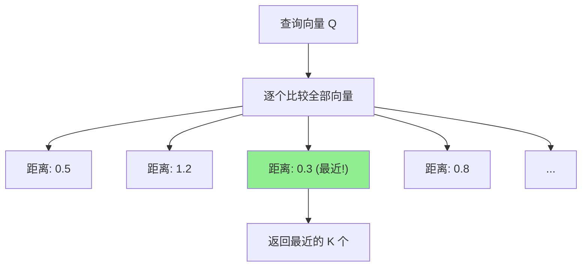

**特点一句话总结**：最准但最慢，适合文档少的时候。

| 优点 | 缺点 |
|-----|------|
| 100%准确 | O(n)线性扫描 |
| 不需要训练 | 文档多了就慢 |
| 实现简单 | 无法扩展 |

**适用**：文档数 < 10万，或者作为基准测试。

---

### 3.2 IndexIVFFlat —— 分区检索（重点理解）

这是最常用的索引，核心思想是**"先分区，再搜索"**。

#### 训练阶段：把空间分成 nlist 个区

想象一个二维平面上散布着很多点（文档向量）：

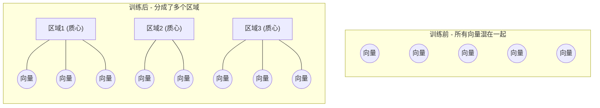

训练使用 **K-Means 聚类**算法：
1. 随机选 nlist 个点作为"质心"（区域中心）
2. 每个向量分配到最近的质心
3. 重新计算质心位置
4. 重复2-3步，直到稳定

#### 搜索阶段：只搜索 nprobe 个区

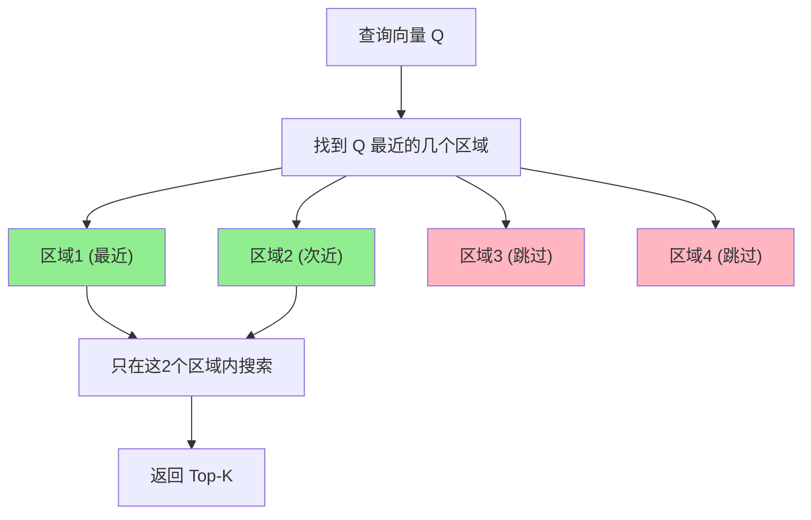

**为什么快了？**
- 假设 100万文档，分成 1000 个区（nlist=1000）
- 每个区平均 1000 个文档
- 搜索 10 个区（nprobe=10）：只需比较 10,000 个文档
- 比暴力搜索少了 **100倍** 计算量！

#### 两个关键参数

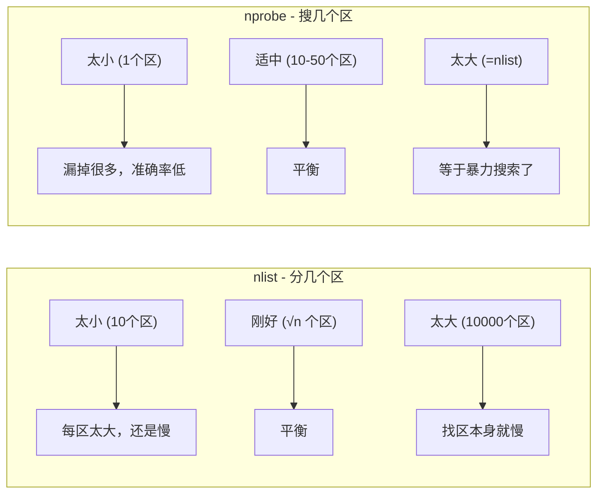

**经验公式**：
- `nlist` = √n（n 是文档数量）
  - 10万文档 → nlist ≈ 316
  - 100万文档 → nlist ≈ 1000
- `nprobe` = 10~50（根据准确率需求调整）

---

### 3.3 IndexHNSW —— 层次图（最快）

HNSW 的思想完全不同，它构建了一个**多层的图**结构。

#### 类比：地图导航

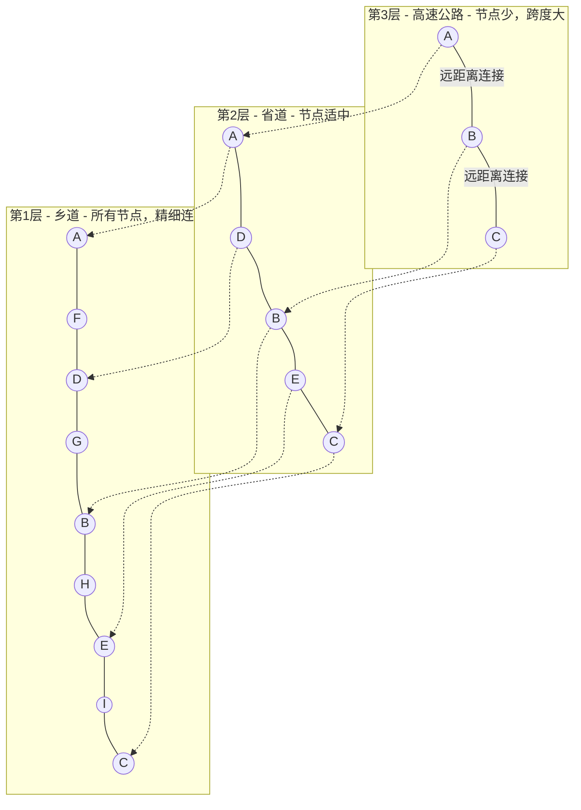

#### 搜索过程

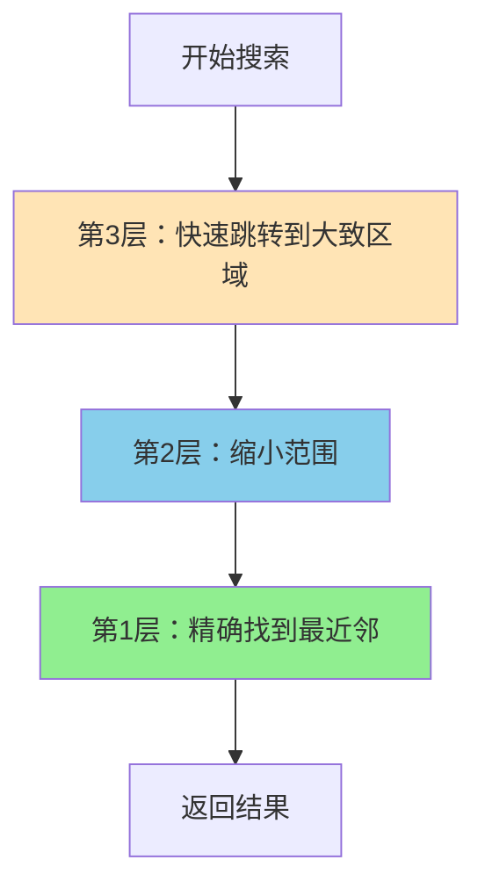

**为什么快？**
- 高层：节点少，一步跳很远，快速接近目标
- 低层：节点多，步子小，精确定位
- 类似于"先坐高铁到城市，再坐地铁到街道，最后步行到门口"

| 参数 | 含义 | 经验值 |
|------|------|--------|
| M | 每个节点的连接数 | 16-64 |
| efConstruction | 构建时搜索范围 | 200-500 |
| efSearch | 查询时搜索范围 | 50-200 |

---

### 3.4 三种索引对比总结

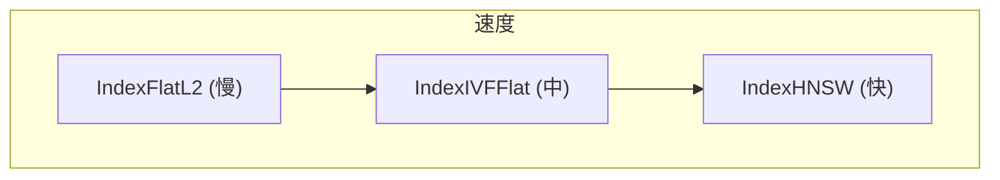

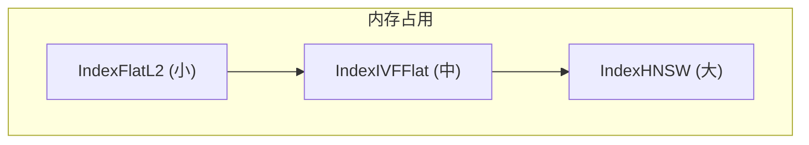

| | IndexFlatL2 | IndexIVFFlat | IndexHNSW |
|--|------------|-------------|-----------|
| **速度** | 慢 | 中（快10-100x） | 快（快1000x） |
| **准确率** | 100% | 95-99% | 95-99% |
| **内存** | 小 | 中 | 大（2-5x） |
| **需要训练** | 否 | 是 | 否 |
| **适用文档数** | < 10万 | 10万-1000万 | 10万-1000万 |
| **更新方便** | 是 | 一般 | 不方便 |

#### 选哪个？

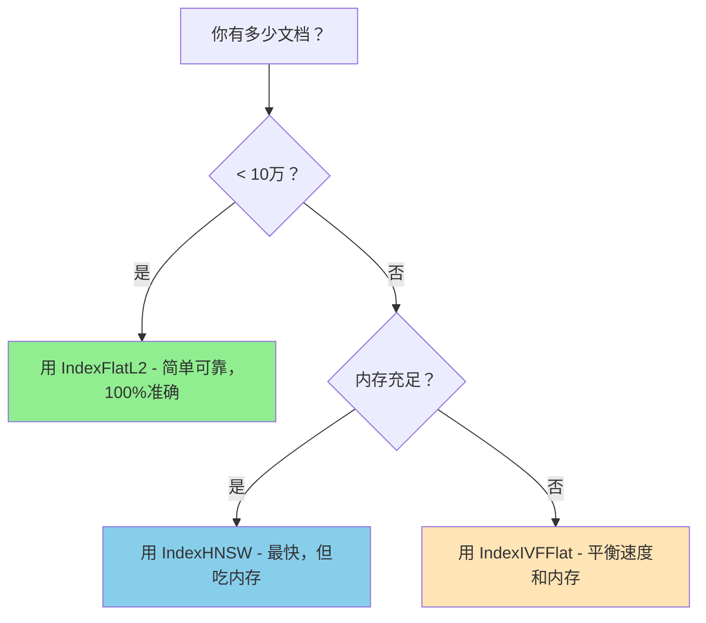

---

## 四、距离度量：L2 vs 余弦相似度

### 4.1 两种距离的区别

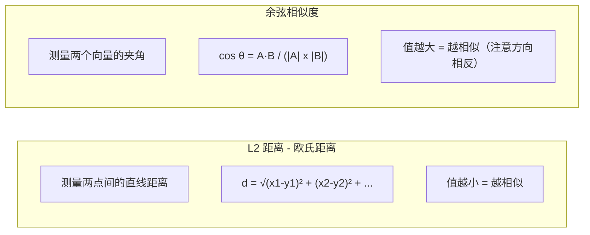

### 4.2 为什么 FAISS 默认用 L2？

1. **计算更快**：不需要额外做归一化
2. **可以等价转换**：向量归一化后，L2 距离和余弦距离效果一样

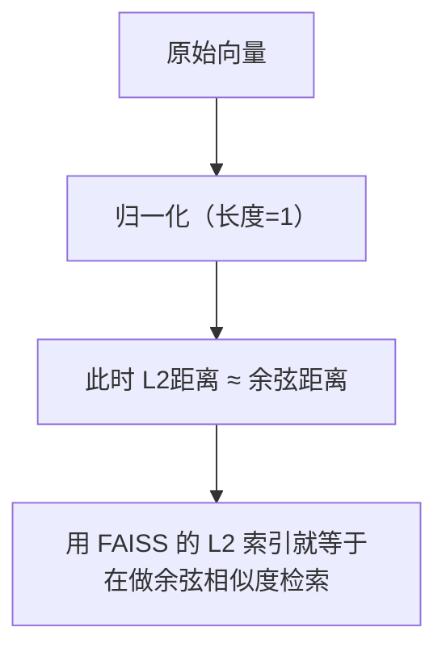

**实践做法**：先归一化，再用 IndexFlatL2，效果等同于余弦相似度。

---

## 五、FAISS 在 RAG 系统中的位置

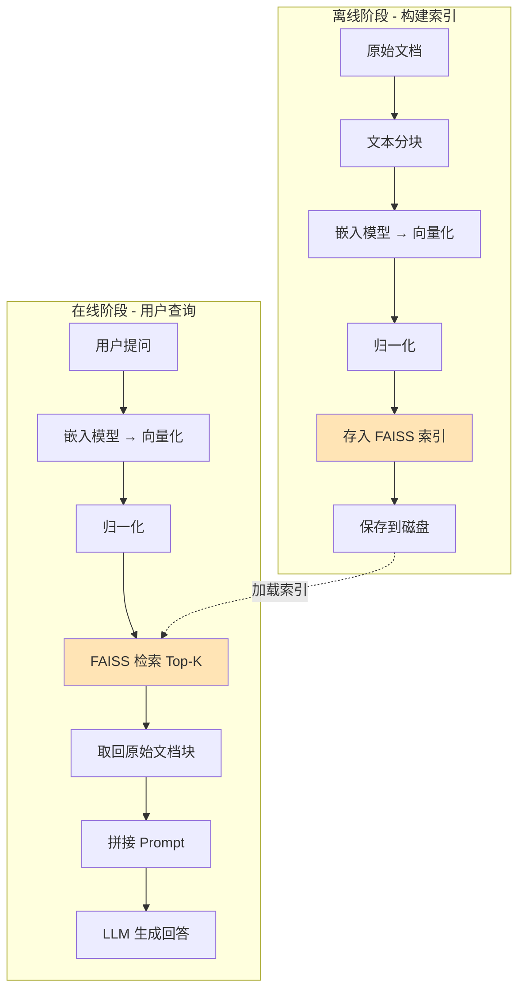

FAISS 承担的就是中间**"快速找到相关文档"**这一步。

---

## 六、常见陷阱

### 陷阱1：忘记归一化

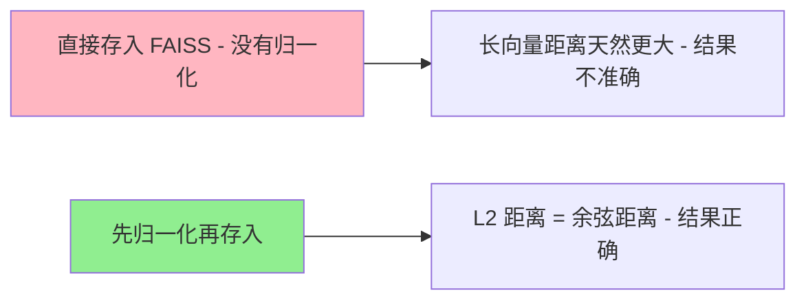

### 陷阱2：IVF 训练数据不够

训练数据至少需要 `nlist x 39` 个向量，否则聚类质量差。

### 陷阱3：nprobe 太小

`nprobe=1` 只搜索1个区域，准确率可能只有 60-70%，漏掉大量相关文档。

### 陷阱4：没有保存索引

构建索引很耗时，一定要 `faiss.write_index()` 保存到磁盘。

---

## 七、思考题

请先思考，然后在下方写入你的回答：

**问题1**：为什么 IndexIVFFlat 比 IndexFlatL2 快？用自己的话解释。

**问题2**：假设有100万文档，nlist=1000，nprobe=10，那么一次查询大约需要比较多少个文档？比暴力搜索少了多少倍？

**问题3**：为什么 HNSW 的"多层图"结构能加速搜索？（想想地图导航的类比）

**问题4**：如果有1000万文档，内存只有8GB，应该选哪种索引？为什么？

**问题5**：在 RAG 系统中，用 95% 准确率的近似搜索代替 100% 准确率的精确搜索，你觉得可以接受吗？为什么？

---

### 学生回答

（请在这里写入你的回答）

**问题1回答**：
这个我可以就理解类似为mysql数据库索引机制，一个L2采用不走索引，从头开始遍历知道找到为止，ivffalt走索引，而且是B+树，先确定一个大范围，逐渐细化，最后精确查找，只需要几层遍历

**问题2回答**：
100万文档，分成1000个区（nlist），每个区就是100万/1000=1000个文档，只查找10个区（nprobe），所以就等于查找10*1000=10000个文档，比全部100万都查少了100倍

**问题3回答**：
这跟问1中提到的B+树索引存储方式类似，也是定义多个层级来快速定位具体信息，其原理就是减少了大量无用的查询，类比国道省道乡道，逐层缩小范围直至精确

**问题4回答**：
大于10万，内存较少，选IVFFlat

**问题5回答**：
可以接受，应为最终查到的数据并不是直接给用户看的，而是给到大模型LLM参考，大模型本身也会进行判断，最后输出与用户问题相关的内容

---

## 八、面试要点

**基础题**：
- 什么是 ANN（近似最近邻搜索）？
- FAISS 的核心思想是什么？
- L2 距离和余弦相似度的区别？

**选型题**：
- 如何根据数据量选择索引类型？
- IndexIVFFlat 和 IndexHNSW 各自的优劣？
- 什么场景下必须用精确搜索？

**调优题**：
- nlist 和 nprobe 如何设置？
- 为什么需要归一化向量？
- 如何平衡准确率和速度？

**进阶题**：
- 如何处理频繁更新的文档？
- 如何评估近似搜索的质量？
- FAISS 的内存占用如何估算？
