# 第四课：文档分块策略（理论篇）

## 学习目标

- 理解为什么需要文档分块
- 掌握不同分块策略的优劣
- 理解分块大小对检索质量的影响
- 学会根据场景选择合适的分块方法
- 理解 chunk_size 和 chunk_overlap 的作用

---

## 一、核心问题：为什么要分块？

### 1.1 直接存储整个文档的问题

假设你有一篇 10 页的技术文档，用户问："如何配置 Redis 缓存？"

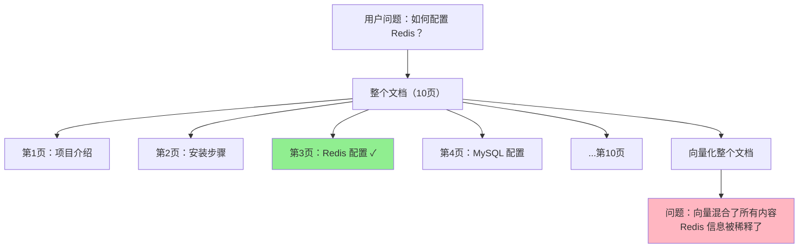

**问题1：信息稀释**
- 整个文档的向量 = 所有内容的"平均"
- Redis 配置只占 1/10，信号被稀释了 90%
- 检索时相似度不高，可能找不到

**问题2：上下文窗口限制**
- LLM 有 token 限制（如 4K、8K、128K）
- 10 页文档可能有 5000 个 token
- 检索到 10 个文档 = 50000 token，超出窗口
- 无法全部喂给 LLM

**问题3：无关信息干扰**
- 用户只关心 Redis 配置
- 但 LLM 收到了整个文档
- 其他 9 页内容是噪音，影响生成质量

### 1.2 分块的解决方案

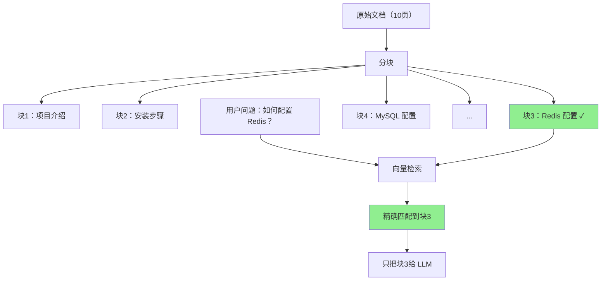

**优势**：
1. **信息聚焦**：每个块只包含一个主题，向量更精确
2. **控制长度**：每个块大小可控，不超过 LLM 窗口
3. **减少噪音**：只返回相关的块，不包含无关内容

---

## 二、分块策略对比

### 2.1 固定长度分块（最常用）

**原理**：按字符数或 token 数切分。

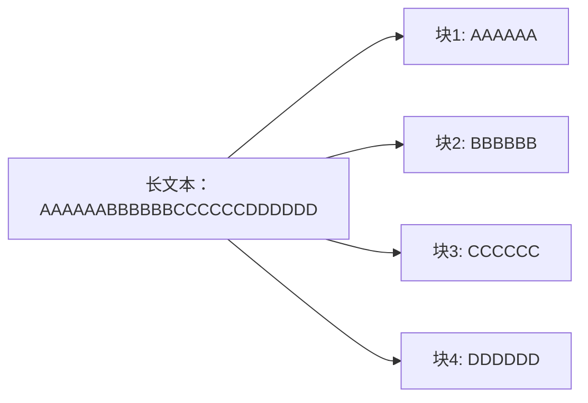

**代码示例**：
```python
def chunk_by_length(text, chunk_size=500, overlap=50):
    chunks = []
    start = 0
    while start < len(text):
        end = start + chunk_size
        chunk = text[start:end]
        chunks.append(chunk)
        start += chunk_size - overlap  # 重叠部分
    return chunks
```

**优点**：
- ✅ 实现简单
- ✅ 速度快
- ✅ 块大小可控

**缺点**：
- ❌ 可能在句子中间切断
- ❌ 不考虑语义边界
- ❌ 可能破坏上下文

**适用场景**：
- 通用文档（没有明显结构）
- 快速原型开发
- 对质量要求不高的场景

---

### 2.2 按句子分块

**原理**：先分句，再组合成块。

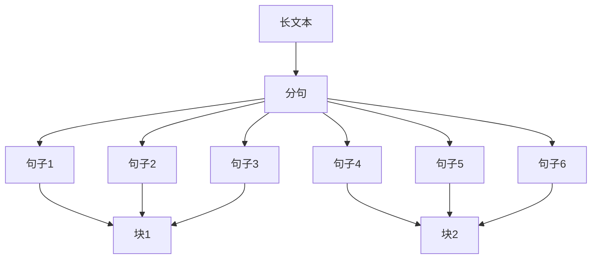

**代码示例**：
```python
import re

def chunk_by_sentence(text, max_sentences=5):
    # 简单分句（实际应用中用 nltk 或 spacy）
    sentences = re.split(r'[。！？.!?]', text)
    
    chunks = []
    current_chunk = []
    
    for sent in sentences:
        current_chunk.append(sent)
        if len(current_chunk) >= max_sentences:
            chunks.append(''.join(current_chunk))
            current_chunk = []
    
    if current_chunk:
        chunks.append(''.join(current_chunk))
    
    return chunks
```

**优点**：
- ✅ 保持句子完整性
- ✅ 语义更连贯
- ✅ 不会在句子中间切断

**缺点**：
- ⚠️ 块大小不均匀（句子长短不一）
- ⚠️ 需要分句器（中文分句较复杂）
- ❌ 可能在段落中间切断

**适用场景**：
- 对语义完整性要求高
- 文档有明确的句子结构
- 问答系统（答案通常是完整句子）

---

### 2.3 按段落/章节分块（结构化文档）

**原理**：利用文档的自然结构。

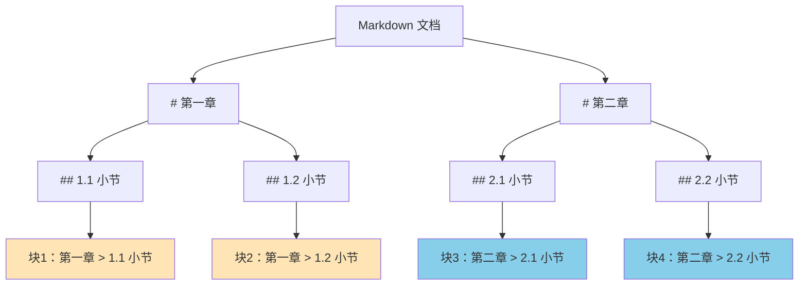

**代码示例**：
```python
def chunk_by_markdown_section(markdown_text):
    chunks = []
    current_chunk = []
    current_headers = []
    
    for line in markdown_text.split('\n'):
        if line.startswith('#'):
            # 遇到新标题，保存之前的块
            if current_chunk:
                chunk_text = '\n'.join(current_headers + current_chunk)
                chunks.append(chunk_text)
                current_chunk = []
            
            # 更新标题层级
            level = len(line.split()[0])  # 统计 # 的数量
            current_headers = current_headers[:level-1] + [line]
        else:
            current_chunk.append(line)
    
    # 保存最后一个块
    if current_chunk:
        chunks.append('\n'.join(current_headers + current_chunk))
    
    return chunks
```

**优点**：
- ✅ 保持主题完整性
- ✅ 保留层级结构（标题信息）
- ✅ 语义边界清晰
- ✅ 适合技术文档、书籍

**缺点**：
- ❌ 需要文档有明确结构
- ⚠️ 块大小可能差异很大
- ❌ 对非结构化文本不适用

**适用场景**：
- Markdown/HTML 文档
- 技术文档、API 文档
- 书籍、论文

---

### 2.4 语义分块（最先进，但复杂）

**原理**：用 AI 模型判断语义边界。

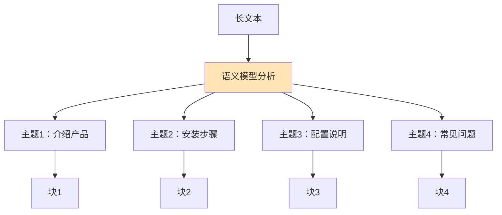

**方法**：
1. 用嵌入模型计算每个句子的向量
2. 计算相邻句子的相似度
3. 相似度突然下降的地方 = 主题切换点
4. 在切换点分块

**优点**：
- ✅ 语义边界最准确
- ✅ 主题完整性最好
- ✅ 适应各种文档类型

**缺点**：
- ❌ 计算成本高（需要多次嵌入）
- ❌ 实现复杂
- ⚠️ 块大小不可控

**适用场景**：
- 对质量要求极高
- 文档结构复杂
- 有充足计算资源

---

## 三、关键参数：chunk_size 和 chunk_overlap

### 3.1 chunk_size（块大小）

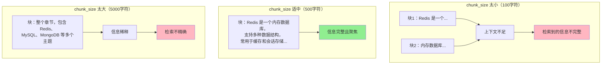

**权衡**：

| chunk_size | 优点 | 缺点 | 适用场景 |
|-----------|------|------|---------|
| **小（100-200）** | 精确匹配 | 上下文不足 | 关键词搜索 |
| **中（500-1000）** | 平衡 | - | 通用场景 ✓ |
| **大（2000+）** | 上下文丰富 | 信息稀释 | 长文本理解 |

**经验值**：
- 英文：500-1000 字符
- 中文：300-600 字符（中文信息密度更高）
- Token 计数：100-300 tokens

---

### 3.2 chunk_overlap（重叠部分）

**为什么需要重叠？**

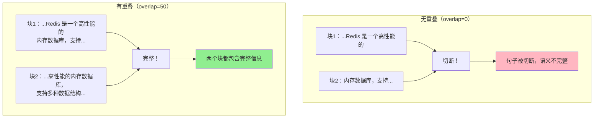

**重叠的作用**：
1. **防止切断关键信息**：重要句子可能跨越块边界
2. **保持上下文连贯**：下一块的开头能看到上一块的结尾
3. **提高召回率**：同一信息出现在多个块中，更容易被检索到

**权衡**：

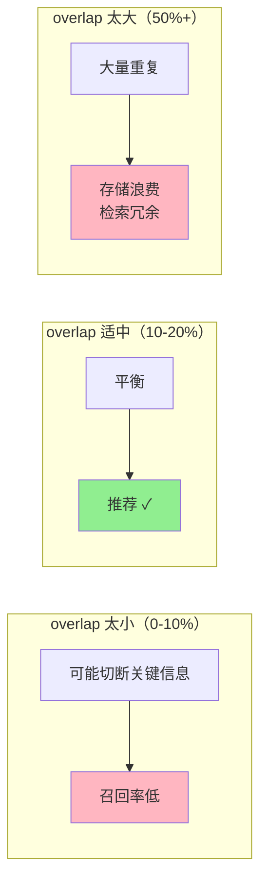

**经验值**：
- overlap = chunk_size × 10-20%
- 例如：chunk_size=500，overlap=50-100

---

## 四、实际案例分析

### 案例1：技术文档 RAG

**场景**：为公司内部技术文档构建 RAG 系统。

**文档特点**：
- Markdown 格式
- 有清晰的章节结构
- 包含代码示例

**最佳策略**：
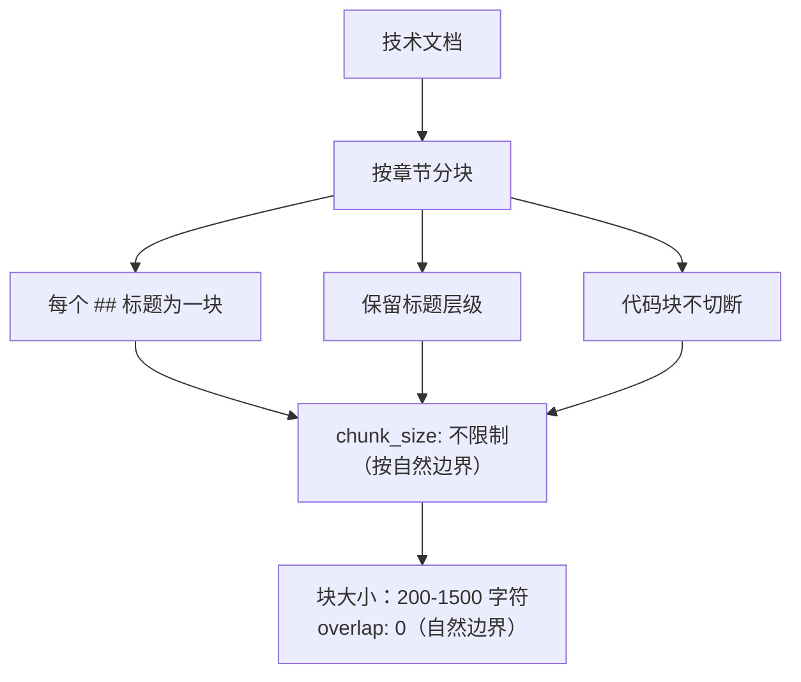

**为什么这样选？**
- 技术文档有明确结构，按章节分块最自然
- 保留标题信息，LLM 能理解上下文
- 代码示例不切断，保持完整性

---

### 案例2：客服对话 RAG

**场景**：基于历史客服对话构建问答系统。

**文档特点**：
- 一问一答的对话
- 每条对话独立
- 长度不一

**最佳策略**：
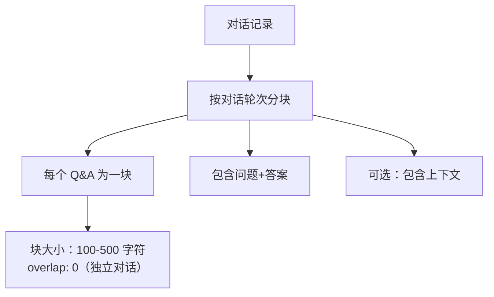

**为什么这样选？**
- 每个 Q&A 是独立的知识单元
- 用户问题通常对应一个完整的 Q&A
- 不需要重叠（对话之间无关联）

---

### 案例3：长篇小说 RAG

**场景**：为小说构建情节检索系统。

**文档特点**：
- 连续叙事
- 没有明确章节（或章节很长）
- 需要保持故事连贯性

**最佳策略**：
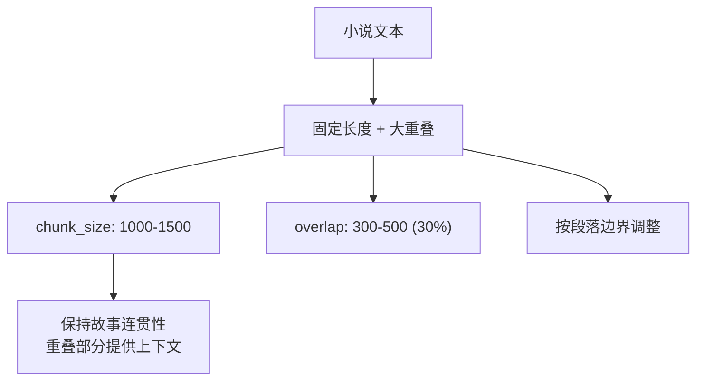

**为什么这样选？**
- 小说没有自然分块点
- 大重叠保证故事连贯性
- 按段落边界微调，不在句子中间切断

---

## 五、分块质量评估

### 5.1 如何判断分块策略好坏？

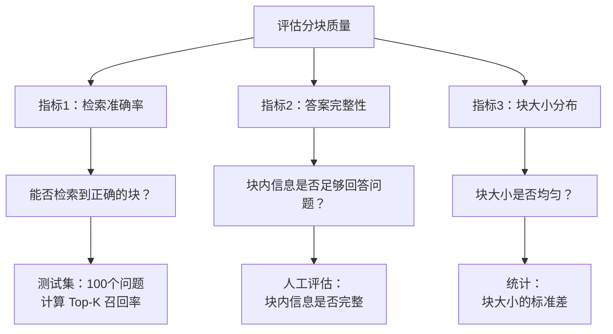

### 5.2 常见问题诊断

| 问题 | 可能原因 | 解决方案 |
|------|---------|---------|
| 检索不到相关文档 | chunk_size 太大，信息稀释 | 减小 chunk_size |
| 检索到的信息不完整 | chunk_size 太小 | 增大 chunk_size |
| 答案前后不连贯 | overlap 太小 | 增大 overlap |
| 检索结果重复 | overlap 太大 | 减小 overlap |
| 块大小差异大 | 按章节分块，章节长短不一 | 设置最大块大小限制 |

---

## 六、思考题

请先思考，然后在下方写入你的回答：

**问题1**：为什么不能直接把整个文档存入 FAISS？（从向量表示和 LLM 窗口两个角度回答）

**问题2**：假设你在做一个代码库问答系统，应该如何分块？（提示：代码有函数、类等自然边界）

**问题3**：chunk_size=500, overlap=100，那么一个 5000 字符的文档会被分成多少块？（计算一下）

**问题4**：为什么技术文档适合按章节分块，而小说适合固定长度分块？

**问题5**：如果用户问题很短（如"Redis 配置"），但文档块很长（1000字符），会有什么问题？

---

### 学生回答

（请在这里写入你的回答）

**问题1回答**：


**问题2回答**：


**问题3回答**：


**问题4回答**：


**问题5回答**：


---

## 七、面试要点

**基础题**：
- 为什么需要文档分块？
- chunk_size 和 chunk_overlap 的作用？
- 常见的分块策略有哪些？

**场景题**：
- 如何为技术文档选择分块策略？
- 如何为对话数据选择分块策略？
- 如何处理代码文件的分块？

**调优题**：
- chunk_size 如何选择？
- overlap 设置多大合适？
- 如何评估分块质量？

**进阶题**：
- 如何处理跨块的引用关系？
- 如何保留文档的元数据（标题、作者等）？
- 如何处理多语言文档的分块？

---

## 八、下一步

阅读完这个理论文档后：

1. **回答思考题**
2. **运行实验脚本**（我会创建）：
   - `lesson4_chunking_comparison.py` - 对比不同分块策略
   - `lesson4_chunk_size_impact.py` - chunk_size 对检索的影响
   - `lesson4_overlap_impact.py` - overlap 的作用演示

3. **准备进入第五课**：检索优化与评估
