# 第五课：检索优化与评估（理论篇）

## 学习目标

- 理解 RAG 系统的评估指标
- 掌握检索质量优化方法
- 理解混合检索的原理
- 学会重排序（Reranking）技术
- 了解生产环境的常见问题和解决方案

---

## 一、RAG 系统的完整流程回顾

在讲优化之前，先回顾一下完整的 RAG 流程：

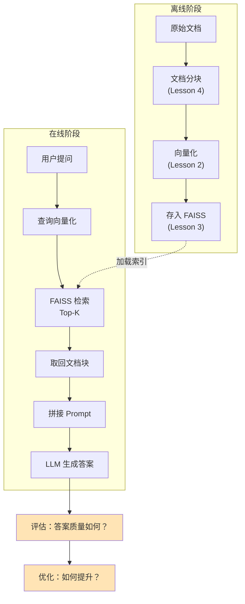

**第五课的重点**：如何评估和优化这个流程？

---

## 二、评估指标

### 2.1 检索阶段的指标

检索的目标：**找到与问题相关的文档块**。

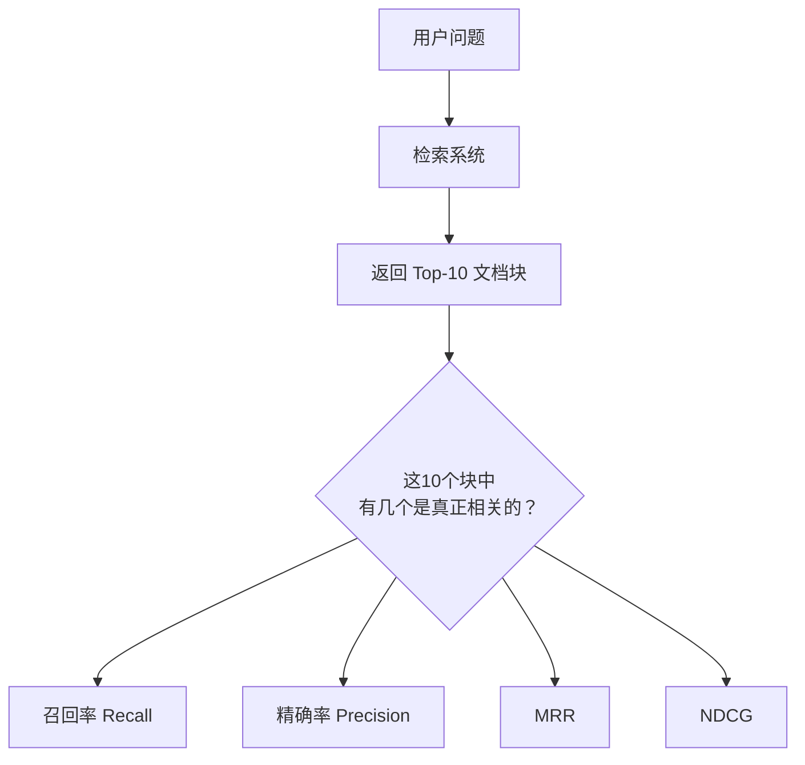

#### 指标1：召回率（Recall）

**定义**：检索到的相关文档 / 所有相关文档

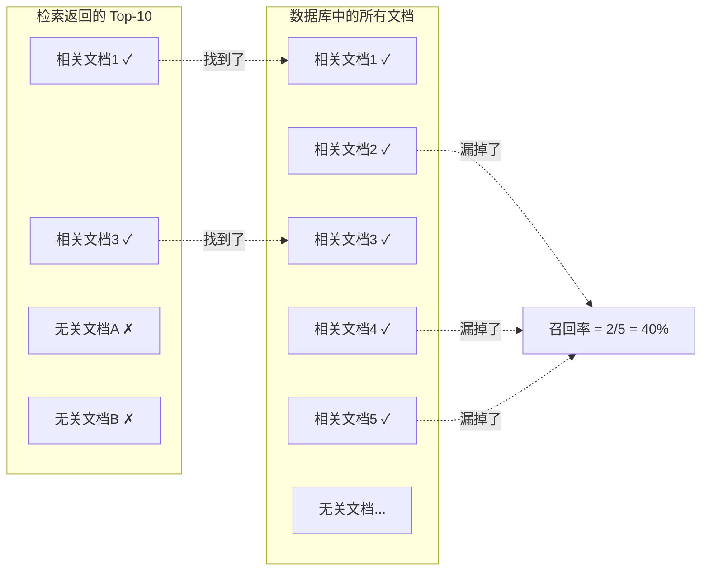

**公式**：
```
召回率 = 检索到的相关文档数 / 总相关文档数
```

**例子**：
- 数据库中有 5 个相关文档
- 检索返回 Top-10，其中 3 个是相关的
- 召回率 = 3/5 = 60%

**意义**：衡量"有没有漏掉重要信息"

#### 指标2：精确率（Precision）

**定义**：检索到的相关文档 / 检索返回的所有文档

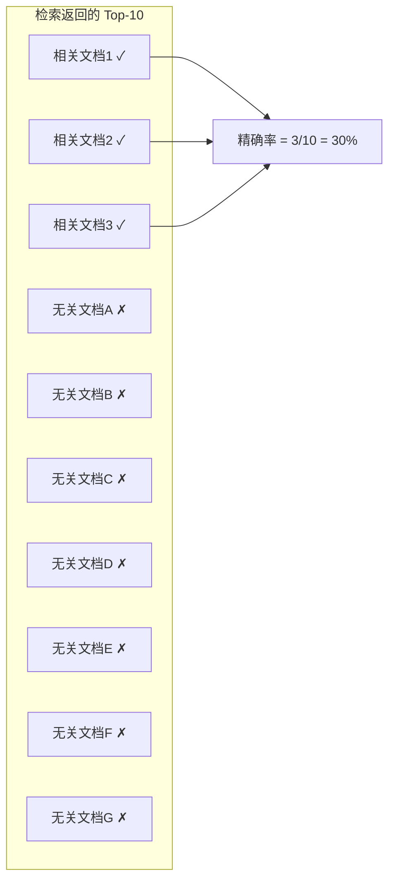

**公式**：
```
精确率 = 检索到的相关文档数 / 返回的文档总数
```

**例子**：
- 检索返回 Top-10
- 其中 3 个是相关的，7 个是无关的
- 精确率 = 3/10 = 30%

**意义**：衡量"返回的结果有多少是噪音"

#### 指标3：MRR（Mean Reciprocal Rank）

**定义**：第一个相关文档的排名倒数的平均值。

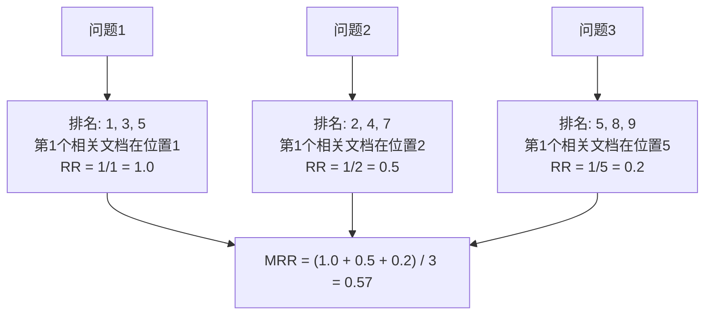

**公式**：
```
RR = 1 / 第一个相关文档的排名
MRR = 所有查询的 RR 平均值
```

**意义**：衡量"用户是否能快速找到答案"（第一个相关结果越靠前越好）

#### 指标4：NDCG（Normalized Discounted Cumulative Gain）

**核心思想**：
- 相关文档排名越靠前，得分越高
- 考虑相关性的程度（不只是相关/不相关，还有"非常相关"、"一般相关"）

**适用场景**：搜索引擎、推荐系统

---

### 2.2 生成阶段的指标

生成的目标：**基于检索到的文档，生成准确的答案**。

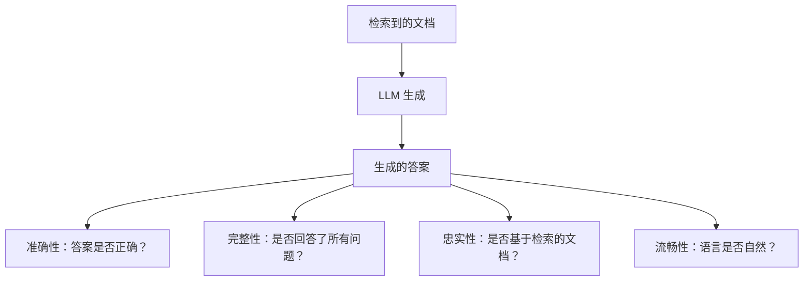

#### 指标1：准确性（Correctness）

**评估方法**：
- 人工评估：专家判断答案是否正确
- 自动评估：与标准答案对比（BLEU、ROUGE 等）

#### 指标2：忠实性（Faithfulness）

**定义**：答案是否基于检索到的文档，而不是 LLM 的"幻觉"。

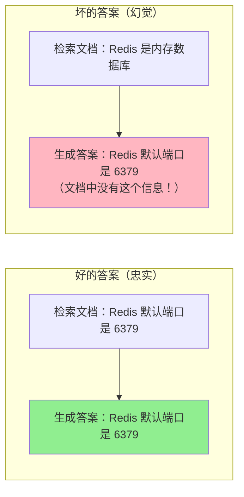

**评估方法**：
- 检查答案中的每个事实是否能在检索文档中找到
- 使用 NLI（自然语言推理）模型自动判断

#### 指标3：完整性（Completeness）

**定义**：答案是否回答了用户问题的所有方面。

**例子**：
- 问题："如何安装和配置 Redis？"
- 不完整答案："使用 apt install redis 安装"（只回答了安装，没有配置）
- 完整答案："使用 apt install redis 安装，然后编辑 /etc/redis/redis.conf 配置端口和密码"

---

## 三、检索优化方法

### 3.1 查询扩展（Query Expansion）

**问题**：用户的查询可能太短或表达不清。

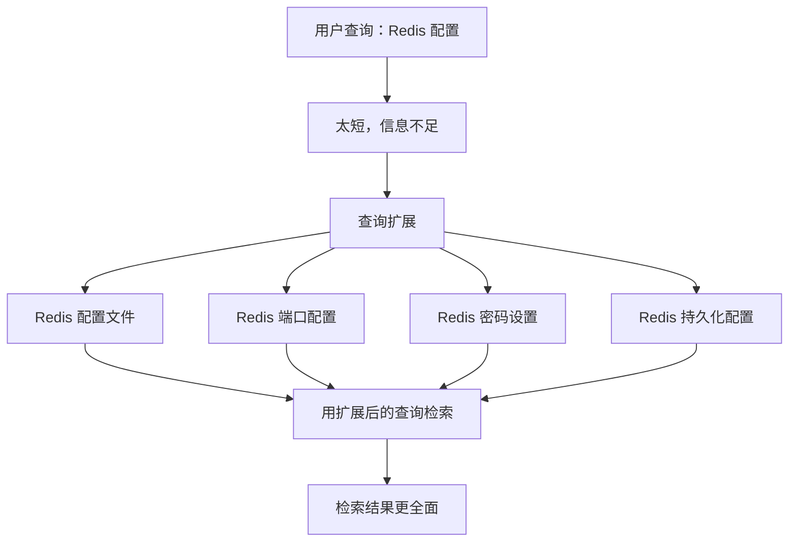

**方法1：用 LLM 扩展查询**
```python
# 伪代码
original_query = "Redis 配置"
expanded_query = llm.generate(
    f"将这个查询扩展成更详细的问题：{original_query}"
)
# 输出："如何配置 Redis 的端口、密码和持久化选项？"
```

**方法2：添加同义词**
```python
query = "Redis 配置"
synonyms = ["Redis 设置", "Redis config", "Redis 参数"]
# 用多个查询检索，合并结果
```

---

### 3.2 混合检索（Hybrid Search）

**核心思想**：结合向量检索和关键词检索。

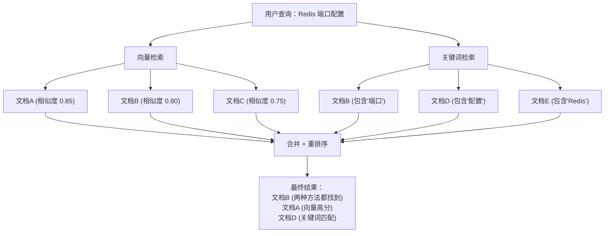

**为什么需要混合？**

| 方法 | 优势 | 劣势 |
|------|------|------|
| **向量检索** | 理解语义，找相似内容 | 对精确关键词不敏感 |
| **关键词检索** | 精确匹配，找特定词 | 不理解语义 |
| **混合检索** | 两者优势结合 | 实现复杂 |

**例子**：
- 查询："Python 列表推导式"
- 向量检索：找到语义相关的"列表生成器"、"循环创建列表"
- 关键词检索：精确找到包含"列表推导式"的文档
- 混合：两者都找到，结果更全面

**实现方法**：
```python
# 伪代码
def hybrid_search(query, top_k=10):
    # 1. 向量检索
    vector_results = faiss_search(query, top_k=20)
    
    # 2. 关键词检索（BM25）
    keyword_results = bm25_search(query, top_k=20)
    
    # 3. 合并（加权）
    final_results = []
    for doc in set(vector_results + keyword_results):
        vector_score = get_score(doc, vector_results)
        keyword_score = get_score(doc, keyword_results)
        
        # 加权合并
        final_score = 0.7 * vector_score + 0.3 * keyword_score
        final_results.append((doc, final_score))
    
    # 4. 排序
    final_results.sort(key=lambda x: x[1], reverse=True)
    return final_results[:top_k]
```

---

### 3.3 重排序（Reranking）

**核心思想**：两阶段检索。

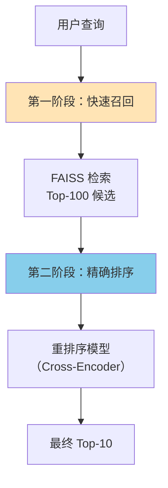

**为什么需要两阶段？**

| 阶段 | 模型 | 速度 | 准确率 | 处理量 |
|------|------|------|--------|--------|
| **第一阶段** | Bi-Encoder<br/>(Sentence-BERT) | 快 | 中 | 100万文档 |
| **第二阶段** | Cross-Encoder<br/>(BERT) | 慢 | 高 | 100个候选 |

**Bi-Encoder vs Cross-Encoder**：

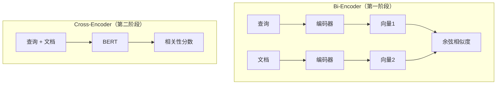

**Bi-Encoder**：
- 查询和文档分别编码
- 可以预先编码所有文档
- 查询时只需编码查询，然后计算相似度
- **快**，但准确率一般

**Cross-Encoder**：
- 查询和文档一起输入 BERT
- BERT 能看到两者的交互信息
- 每次查询都要重新计算
- **慢**，但准确率高

**实现**：
```python
from sentence_transformers import CrossEncoder

# 第一阶段：FAISS 快速召回
candidates = faiss_search(query, top_k=100)

# 第二阶段：重排序
reranker = CrossEncoder('cross-encoder/ms-marco-MiniLM-L-6-v2')
pairs = [[query, doc] for doc in candidates]
scores = reranker.predict(pairs)

# 按分数排序
reranked = sorted(zip(candidates, scores), 
                  key=lambda x: x[1], 
                  reverse=True)
final_results = reranked[:10]
```

---

### 3.4 多路召回（Multi-Recall）

**核心思想**：用多种方法检索，合并结果。

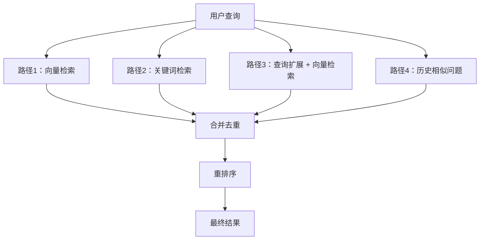

**优势**：
- 提高召回率（不同方法找到不同的相关文档）
- 降低单一方法失效的风险

**劣势**：
- 计算成本高
- 需要合理的合并策略

---

## 四、常见问题和解决方案

### 问题1：检索到的文档不相关

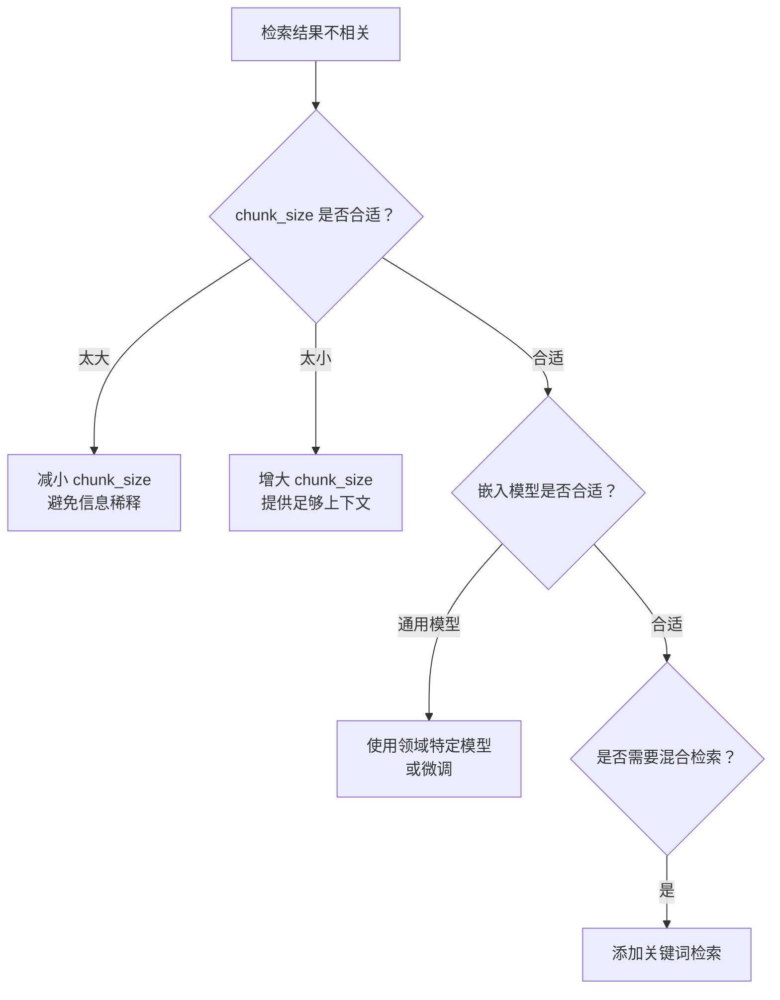

### 问题2：答案包含幻觉

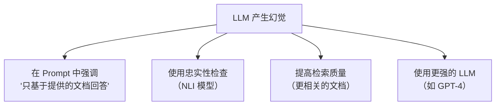

### 问题3：检索速度慢

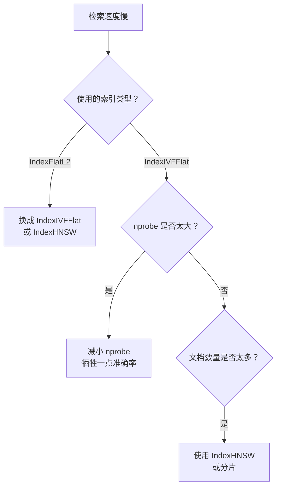

### 问题4：内存占用太大

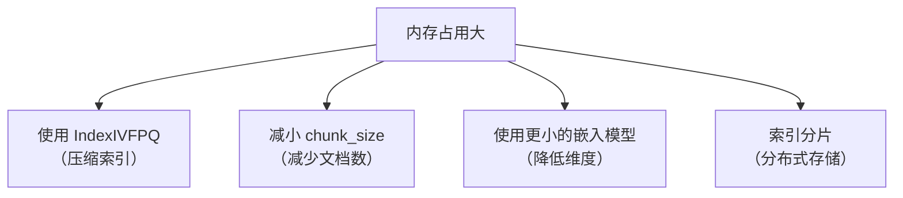

---

## 五、生产环境最佳实践

### 5.1 系统架构

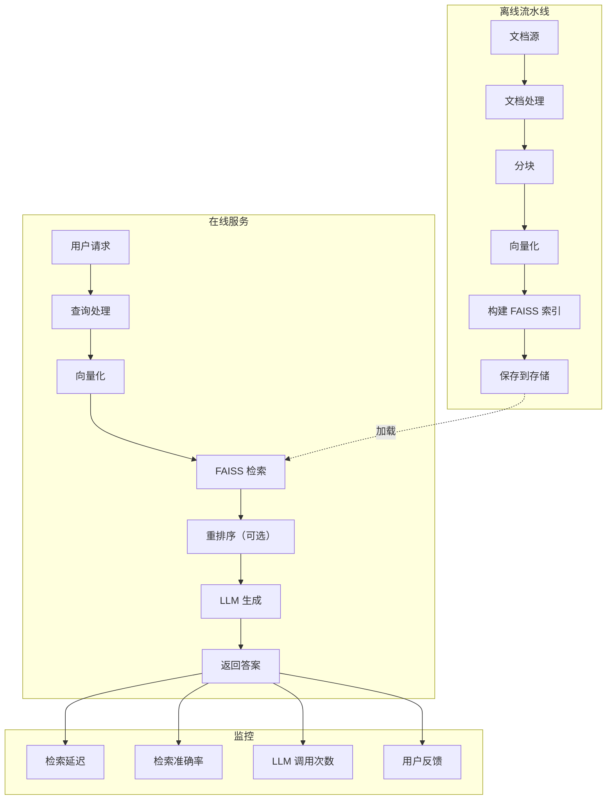

### 5.2 性能优化清单

**离线阶段**：
- ✅ 批量处理文档（不要一个个处理）
- ✅ 选择合适的 chunk_size 和 overlap
- ✅ 使用合适的索引类型
- ✅ 定期更新索引（增量更新或全量重建）

**在线阶段**：
- ✅ 预加载索引到内存
- ✅ 使用缓存（相同查询直接返回）
- ✅ 批量查询（如果有多个查询）
- ✅ 异步处理（检索和 LLM 可以并行）

**监控指标**：
- ✅ P50/P95/P99 延迟
- ✅ 检索准确率（定期人工评估）
- ✅ LLM 成本（token 使用量）
- ✅ 用户满意度（点赞/点踩）

---

## 六、思考题

**问题1**：为什么需要两阶段检索（召回 + 重排序）？为什么不直接用 Cross-Encoder 检索所有文档？

**问题2**：混合检索中，向量检索和关键词检索的权重应该如何设置？（提示：考虑不同场景）

**问题3**：如果用户反馈"答案不准确"，你会从哪些方面排查问题？（至少列出3个方面）

**问题4**：假设你的 RAG 系统检索延迟是 500ms，LLM 生成延迟是 2000ms，如何优化总延迟？

**问题5**：如何评估一个 RAG 系统的整体质量？（从检索和生成两个阶段考虑）

---

### 学生回答

（请在这里写入你的回答）

**问题1回答**：
因为 Cross-Encoder 需要把查询和每个文档一起输入 BERT，计算成本非常高。如果有100万文档，就需要调用100万次 BERT，延迟可能达到几小时。而两阶段检索先用快速的 Bi-Encoder（FAISS）从100万文档中筛选出100个候选（只需几毫秒），再用 Cross-Encoder 精确排序这100个（只需几百毫秒），总延迟控制在1秒内。这是用"召回 + 精排"的思路平衡速度和准确率。

**问题2回答**：
权重设置取决于场景：
- **精确匹配场景**（如法律文档、代码搜索）：关键词权重更高，如 0.3 向量 + 0.7 关键词，因为用户可能在找特定的函数名、法条编号等精确词汇。
- **语义理解场景**（如客服问答、知识库）：向量权重更高，如 0.7 向量 + 0.3 关键词，因为用户的表达方式多样，需要理解语义。
- **通用场景**：平衡权重，如 0.5 向量 + 0.5 关键词，或通过 A/B 测试找到最优比例。
实际应用中，可以根据用户反馈动态调整权重。

**问题3回答**：
排查方向：
1. **检索质量**：检索到的文档是否相关？用 `print(retrieved_docs)` 查看，如果文档本身就不相关，说明是检索问题（chunk_size 不合适、嵌入模型不匹配、需要混合检索）。
2. **文档完整性**：检索到的文档块是否包含足够信息回答问题？如果信息不完整，需要增大 chunk_size 或 overlap。
3. **LLM 幻觉**：LLM 是否基于文档回答，还是自己编造？检查 Prompt 是否强调"只基于提供的文档"，或使用忠实性检查。
4. **Prompt 设计**：Prompt 是否清晰？是否给了足够的指令和示例？
5. **LLM 能力**：模型是否足够强？可以尝试更强的模型（如 GPT-4）。

**问题4回答**：
优化思路：
1. **检索优化**（500ms → 100ms）：
   - 换更快的索引（IndexFlatL2 → IndexHNSW）
   - 减小 nprobe（牺牲一点准确率）
   - 使用缓存（相同查询直接返回）
2. **LLM 优化**（2000ms → 1000ms）：
   - 使用更快的模型（如 GPT-3.5-turbo 代替 GPT-4）
   - 减少输入 token（只传最相关的1-2个文档块）
   - 使用流式输出（边生成边返回，用户感知延迟更低）
3. **并行优化**：
   - 检索和 LLM 预热可以并行（如果有多个查询）
   - 使用异步处理
4. **架构优化**：
   - 部署本地 LLM（如 Llama）避免网络延迟
   - 使用 GPU 加速

**问题5回答**：
评估 RAG 系统需要从两个阶段分别评估：

**检索阶段**：
- **召回率**：相关文档有没有被找到？（准备测试集，人工标注相关文档，计算 Top-K 召回率）
- **精确率**：返回的文档有多少是相关的？
- **MRR**：第一个相关文档的排名如何？（用户体验指标）

**生成阶段**：
- **准确性**：答案是否正确？（人工评估或与标准答案对比）
- **忠实性**：答案是否基于检索的文档？（检查是否有幻觉）
- **完整性**：答案是否回答了所有问题？

**整体评估**：
- **端到端测试**：准备100个真实问题，人工评估答案质量（1-5分）
- **用户反馈**：点赞/点踩率、用户满意度调查
- **A/B 测试**：对比不同配置的效果（如不同 chunk_size、不同检索策略）

**监控指标**（生产环境）：
- 延迟（P50/P95/P99）
- 检索准确率（定期抽样评估）
- LLM 成本（token 使用量）
- 错误率（检索失败、LLM 超时等）


---

## 七、课程总结

恭喜你完成了 RAG 学习的全部5课！让我们回顾一下：

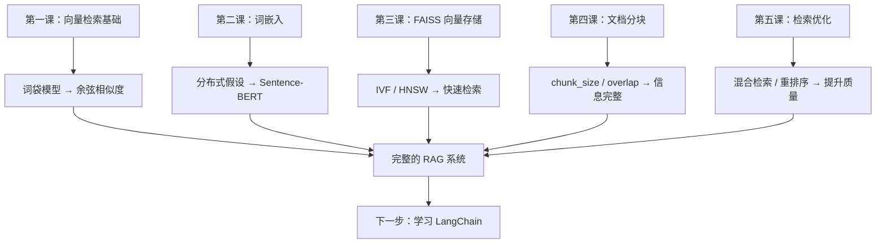

**你现在掌握了**：
- ✅ RAG 的核心原理（从词袋到词嵌入）
- ✅ 向量存储和检索（FAISS 的三种索引）
- ✅ 文档处理策略（分块方法）
- ✅ 检索优化技术（混合检索、重排序）
- ✅ 评估和调优方法

**你可以**：
- ✅ 从零实现一个 RAG 系统
- ✅ 理解每个环节的原理和权衡
- ✅ 根据场景选择合适的技术方案
- ✅ 诊断和解决常见问题
- ✅ 在面试中深入回答 RAG 相关问题

---

## 八、面试要点总结

**基础题**：
- RAG 的完整流程是什么？
- 为什么需要向量检索？
- 什么是词嵌入？

**技术选型题**：
- 如何选择 FAISS 索引类型？
- 如何选择分块策略？
- 什么时候需要重排序？

**优化题**：
- 如何提高检索准确率？
- 如何降低检索延迟？
- 如何减少 LLM 幻觉？

**评估题**：
- 如何评估检索质量？
- 如何评估生成质量？
- 如何监控生产环境的 RAG 系统？

**实战题**：
- 如何处理多语言文档？
- 如何处理代码库问答？
- 如何处理实时更新的文档？

---

## 九、下一步学习建议

### 1. 巩固基础（1-2天）

运行所有实验脚本，验证理论：
```bash
source venv/Scripts/activate

# 第一课
python lessons/lesson1/lesson1_simple_vector.py
python lessons/lesson1/lesson1_cosine_explained.py
python lessons/lesson1/lesson1_limitations.py

# 第二课
python lessons/lesson2/lesson2_embeddings.py
python lessons/lesson2/lesson2_cross_lingual.py

# 第三课（我会补充）
python lessons/lesson3/lesson3_faiss_comparison.py

# 第四课（我会补充）
python lessons/lesson4/lesson4_chunking_comparison.py

# 第五课（我会补充）
python lessons/lesson5/lesson5_hybrid_search.py
python lessons/lesson5/lesson5_reranking.py
```

### 2. 学习 LangChain（2-3天）

现在你理解了底层原理，学 LangChain 会很快：
- Document Loaders（文档加载）
- Text Splitters（分块）
- Vector Stores（向量存储）
- Retrievers（检索器）
- Chains（流程编排）

### 3. 实战项目（1周）

选一个项目实践：
- 个人知识库问答
- 技术文档助手
- 代码库问答
- 客服机器人

### 4. 进阶主题（按需学习）

- 多模态 RAG（文本 + 图片）
- 对话式 RAG（带记忆的多轮对话）
- Agent + RAG（自主决策的智能体）
- GraphRAG（知识图谱增强）

---

恭喜你完成了 RAG 的系统学习！🎉
