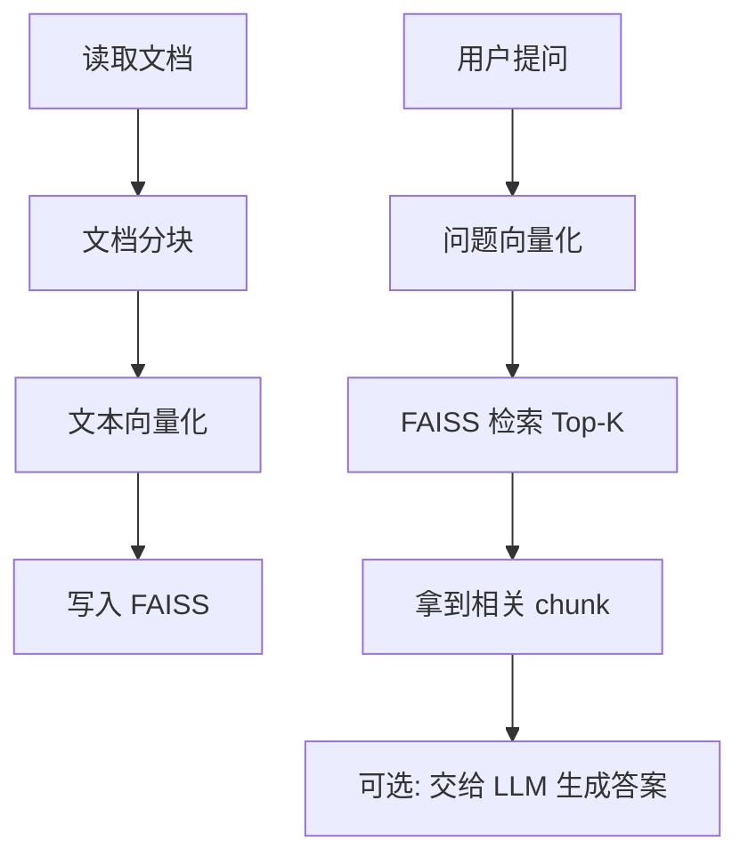
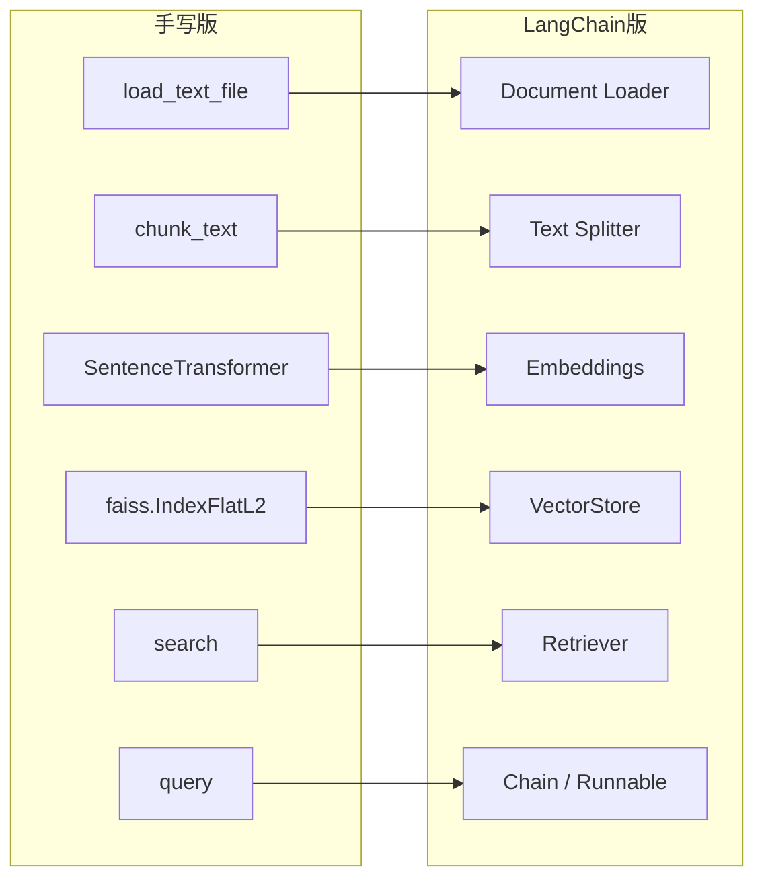
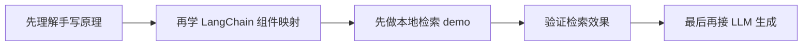
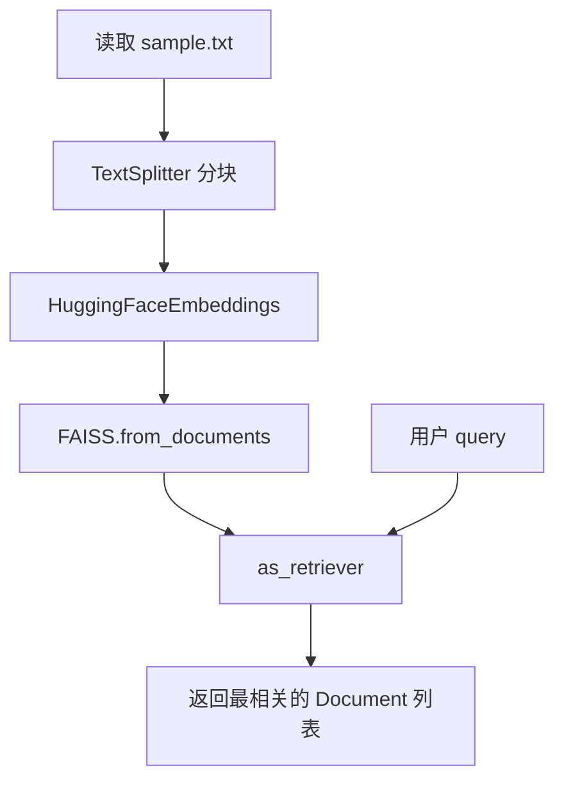
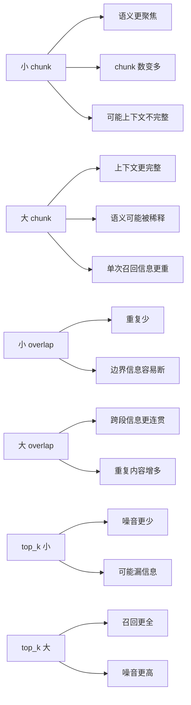

# LangChain 入门：从手写 RAG 到框架化 RAG

## 学习目标

这一节不是重新学习一遍 RAG 原理，而是回答一个更工程化的问题：

**当你已经理解了 RAG 的底层实现后，LangChain 到底帮你做了什么？**

学完这一节，你应该能回答：

- 为什么已经会手写 RAG，还要学 LangChain？
- 当前项目里的 `document_processor.py`、`vector_store.py`、`rag_system.py`，在 LangChain 里分别对应什么？
- 为什么很多 LangChain 代码看起来更短，但本质上还是同一条 RAG 流程？
- LangChain 初学者最常见的坑有哪些？

---

## 一、先说结论：LangChain 解决的不是“原理”，而是“拼装”

回顾你现在已经掌握的手写版 RAG：



这条链路在当前项目中是你自己写出来的：

- `document_processor.py`：负责加载文本、切分 chunk
- `vector_store.py`：负责 embedding + FAISS 建索引 + 检索
- `rag_system.py`：负责把检索和生成串起来

而 LangChain 做的事情，本质上是把这些常见步骤抽象成标准组件。

**所以要记住一句话：**

> LangChain 不是替代 RAG 原理，而是把 RAG 的常见部件做成可复用积木。

---

## 二、和当前项目的映射关系

### 2.1 当前手写实现 vs LangChain 实现



### 2.2 对应表

| 当前项目 | 职责 | LangChain 对应 |
|---|---|---|
| `document_processor.py:3` | 读取文本文件 | Loader |
| `document_processor.py:8` | 文本分块 | Text Splitter |
| `vector_store.py:17` | 句向量模型 | Embeddings |
| `vector_store.py:33` | FAISS 索引 | Vector Store |
| `vector_store.py:39` | Top-K 检索 | Retriever / similarity search |
| `rag_system.py:43` | 查询总流程 | Chain / Runnable pipeline |

你可以把 LangChain 理解成：

- 它没有发明新的 RAG 原理
- 它只是把“加载、切分、嵌入、存储、检索、拼接”的流程标准化了

---

## 三、为什么学 LangChain？

如果你已经会手写，LangChain 的价值主要有 4 个：

### 3.1 组件标准化

你不需要每次都自己写一套：

- 文档加载器
- 分块器
- 向量库封装
- retriever 接口
- prompt 拼装逻辑

### 3.2 更容易替换底层实现

比如你今天用 FAISS，明天可能想换成 Chroma、Milvus、Pinecone。

在手写代码里，你要改很多接口；在 LangChain 里，通常只需要替换某个组件。

### 3.3 更容易做实验

RAG 调优经常要改这些东西：

- chunk_size
- chunk_overlap
- embedding 模型
- top_k
- 检索方式
- 是否加 rerank

LangChain 会让这些实验更快。

### 3.4 更容易接入后续能力

后面如果你要加：

- Prompt 模板
- 多轮对话
- 历史记录
- Router
- Agent
- 工具调用

LangChain 的扩展会更自然。

---

## 四、但它也有代价

LangChain 的代价不是性能，而是**抽象层增加了理解成本**。

### 常见感受

初学者经常会觉得：

- 代码变短了，但更难看懂
- import 很多，不知道谁在做事
- 报错经常来自封装层，不容易定位
- 同样叫 FAISS，但返回值和你原来写的不一样

所以正确学习顺序应该是：



你现在正好就在这个最合适的阶段。

---

## 五、先只学本地检索版，不急着接 LLM

这是这一步最关键的策略。

很多人一上来就写“完整 RAG”会同时遇到 4 类问题：

1. 文档切分问题
2. embedding 检索问题
3. 向量库问题
4. LLM prompt / API 问题

一旦结果不对，就不知道错在谁。

所以我们先做：

**本地文档 → 分块 → embedding → FAISS → Retriever → 输出检索结果**

不接 LLM 的好处是：

- 你能直接观察检索质量
- 你能判断问题出在 chunk 还是 embedding
- 你能先把 RAG 前半段打扎实

---

## 六、最小 LangChain 检索流程长什么样



注意，这里返回的已经不是你之前熟悉的 `(text, score)` 元组，而通常是 `Document` 对象。

一个 `Document` 通常包含：

- `page_content`：正文内容
- `metadata`：来源、编号等附加信息

这也是 LangChain 初学者最容易混淆的地方之一。

---

## 七、和当前项目代码逐段对照

### 7.1 文档加载

当前项目：

- `document_processor.py:3` 的 `load_text_file()` 直接读字符串

LangChain：

- 常见做法是先读成 `Document` 对象列表
- 好处是可以顺手带 metadata

这意味着：

- 手写版更直接
- LangChain 版更适合后面扩展数据来源

### 7.2 文档分块

当前项目：

- `document_processor.py:8` 是字符级滑窗切分
- 你自己控制 `chunk_size` 和 `overlap`

LangChain：

- 用 `RecursiveCharacterTextSplitter` 这类 splitter
- 同样也有 `chunk_size` 和 `chunk_overlap`

所以本质没变，只是：

- 手写版：你自己实现切分逻辑
- LangChain 版：你调用现成切分器

### 7.3 向量化与存储

当前项目：

- `vector_store.py:17` 用 `SentenceTransformer`
- `vector_store.py:33` 用 `faiss.IndexFlatL2`

LangChain：

- embeddings 由 `HuggingFaceEmbeddings` 封装
- 向量库存储由 `FAISS` 封装

本质依然是：

- 文本变向量
- 向量放进 FAISS
- 查询时做相似度搜索

### 7.4 检索接口

当前项目：

- `vector_store.py:39` 返回 `(document, distance)`

LangChain：

- 常用 `vector_store.as_retriever()`
- 然后 `retriever.invoke(query)` 拿回文档列表

所以区别在于：

- 你原来更贴近底层
- LangChain 更强调“统一接口”

---

## 八、为什么同一个参数，效果可能和手写版不一样？

这是实践里一定会遇到的。

虽然你在两边都设置了：

- `chunk_size = 500`
- `chunk_overlap = 50`

但结果仍可能不同，因为：

### 8.1 splitter 逻辑不完全相同

`document_processor.py:8` 是你当前项目自己的规则。

LangChain 的 splitter 可能会：

- 按不同分隔符优先切
- 保留不同边界
- 造成 chunk 数量变化

### 8.2 返回对象不同

LangChain 返回的是 `Document`，不是你之前的简单字符串。

### 8.3 检索接口默认值不同

有些检索方式默认：

- `k` 不同
- 搜索策略不同
- 是否带分数不同

所以你看到“结果不一样”，不一定是错了，而可能只是**封装层默认行为不同**。

---

## 九、LangChain 常见坑

### 坑1：包拆分

现在 LangChain 生态不是一个包打天下，常见会拆成：

- `langchain`
- `langchain-community`
- `langchain-huggingface`

所以最常见报错之一就是：

- 明明装了 `langchain`
- 但某个类不在这个包里

### 坑2：embedding 类名和原生库不一样

你当前项目直接用 `SentenceTransformer`。

但 LangChain 里通常不会直接这样接，而是通过封装类来接 HuggingFace embedding。

所以你要理解：

- 底层模型还是那个模型
- 只是外面套了一层 LangChain 统一接口

### 坑3：以为 Retriever 就返回分数

很多时候 retriever 默认只返回文档，不返回分数。

如果你想研究“为什么它排第一”，通常需要显式调用带分数的方法。

### 坑4：以为 LangChain 自动提高检索质量

不会。

LangChain 只是帮你更方便地搭流程，**不会自动让 embedding 更强，也不会自动让 chunk 更合理**。

决定检索效果的核心仍然是：

- 文档质量
- 分块策略
- embedding 模型
- 检索参数
- 是否需要 rerank

### 坑5：过早接 LLM

如果检索本身不准，接 LLM 只会把问题藏起来。

因为 LLM 会“看起来回答得很自然”，但其实引用的上下文可能已经偏了。

---

## 十、这一节实践时你应该重点观察什么

做完 demo 后，不是只看“能不能跑通”，而要重点观察：

### 10.1 chunk 切得是否合理

问自己：

- 一个 chunk 是否只围绕一个主题？
- 有没有被切得太碎？
- 有没有一个 chunk 太长导致混入噪音？

### 10.2 query 和 chunk 是否真的语义匹配

不是看“返回了结果”，而是看：

- 为什么它排第一？
- 为什么另一个相关 chunk 没进 top_k？
- 是 embedding 模型问题，还是 chunk 边界问题？

### 10.3 top_k 是否合适

- `top_k` 太小：可能漏信息
- `top_k` 太大：会引入噪音

这一步你后面自己优化检索效果时会非常关键。

---

## 十一、你现在该形成的心智模型

学完这一节后，建议把 LangChain 记成下面这句话：

> LangChain = 把手写 RAG 中常见的“文档加载、分块、向量化、检索、拼接”做成标准组件的工程框架。

不是：

- 一个神奇的 AI 黑盒
- 一个自动提高效果的工具
- 一个不需要理解原理也能乱拼的捷径

真正正确的方式是：

- 先知道底层原理
- 再理解框架映射
- 再用框架提高实验效率

这也是你现在开始学它的最好时机。

---

## 十二、这一节之后的实践路线

接下来我们会按这个顺序推进：

1. 先做一个 **本地检索版 LangChain demo**
2. 直接观察 chunk、retriever、top_k 的效果
3. 自己尝试优化检索质量
4. 最后再接入 LLM API，补全生成阶段

这样你能把问题拆开看，而不是一上来陷入“到底是哪层出了问题”的混乱。

---



### 参数实验建议

在运行 demo 时，不要急着改代码，先直接改参数观察现象：

```bash
source venv/Scripts/activate
python lessons/lesson6/lesson6_langchain_retrieval.py --chunk-size 200 --chunk-overlap 20 --top-k 2
python lessons/lesson6/lesson6_langchain_retrieval.py --chunk-size 500 --chunk-overlap 50 --top-k 3
python lessons/lesson6/lesson6_langchain_retrieval.py --chunk-size 900 --chunk-overlap 100 --top-k 4
```

重点观察 3 件事：
- chunk 数量怎么变
- 每个 query 的 Top-K 结果是否更相关
- 结果里是“信息不全”更多，还是“噪音太多”更多

---

## 思考题

先不要急着往下翻代码，先自己想 3 个问题：

1. 如果 LangChain 只是把组件标准化了，那它相比手写版真正节省的是哪部分工作？
2. 为什么我们现在要先做“本地检索版”，而不是直接接 OpenAI？
3. 如果 LangChain demo 的检索结果和当前手写版不一样，你觉得最可能先排查哪三类原因？

1.节省的就是重复编写实现基础功能的部分
2.我们要先保证检索效果，才能保证接入大模型后的最终输出结果最优
3.分块的大小和质量，overlop的大小，embeding模型的质量，或者考虑加入重排