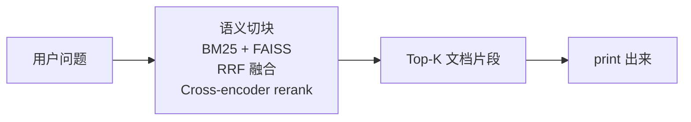
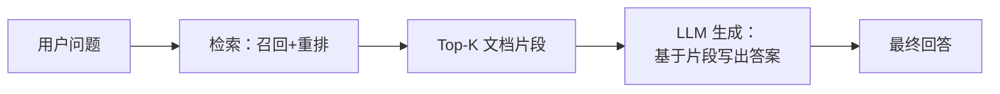
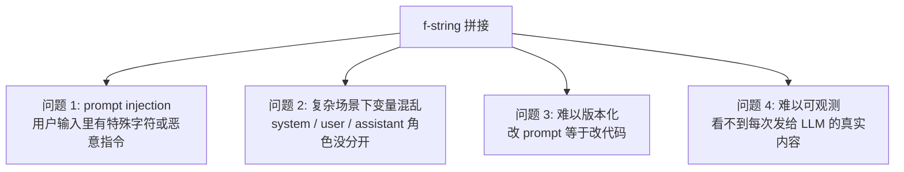
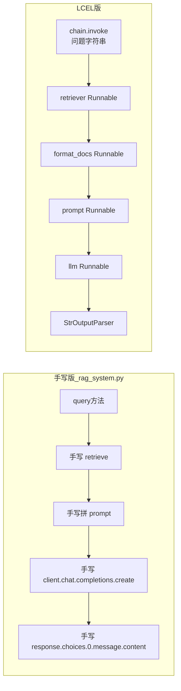
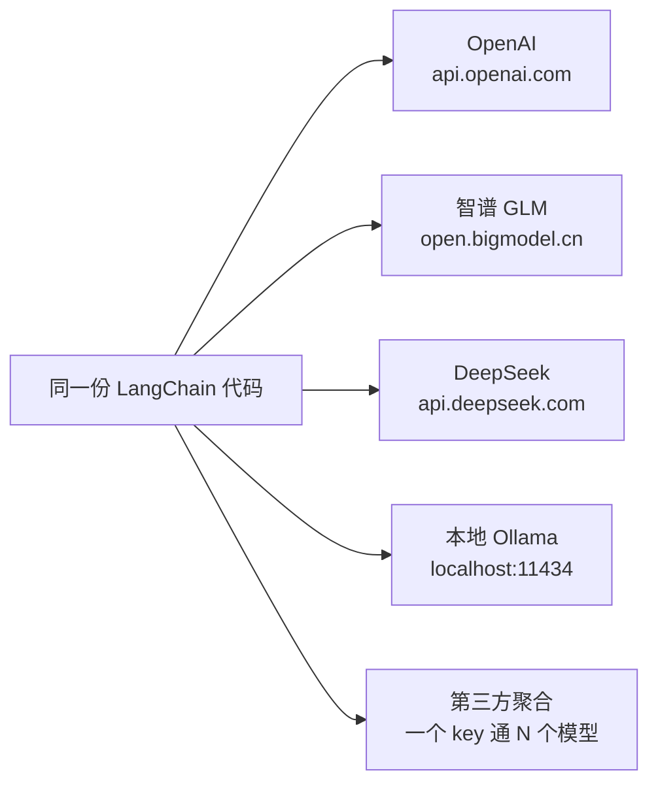
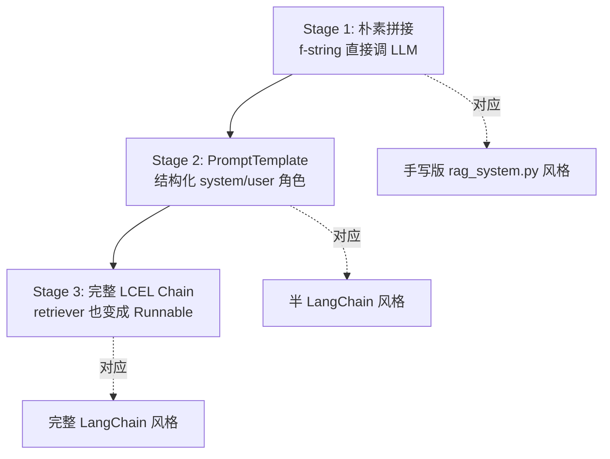

# 第六课收尾：从检索到生成（接入 GLM）

## 学习目标

这一节是 Lesson 6 的最后一段，也是整个手写 RAG 流程的"闭环"。学完你应该能回答：

- 为什么"只检索"还不够？生成阶段到底在解决什么问题？
- Prompt 模板和"f-string 拼字符串"的本质区别是什么？
- LangChain 的 LCEL（`|` 串联）和你之前在 `rag_system.py` 里手写的 `prompt → llm → 解析` 三步走，工程上各有什么差别？
- 为什么你能用同一份 LangChain 代码切换 GLM / OpenAI / DeepSeek？

---

## 一、回顾：你现在的 demo 卡在哪里

`lesson6_langchain_retrieval.py` 已经实现了：



它把最相关的 3 个片段打印出来——但仅此而已。**没有人帮你把这些片段读成一句答案**。

完整 RAG 应该是：



差的就是 **G（Generation）** 这一步。这一节就是把它补上。

---

## 二、为什么"检索"还不够？

### 2.1 检索 vs 生成的本质区别

| 维度 | 检索（Retrieval） | 生成（Generation） |
|---|---|---|
| 输出 | 一堆**原文片段** | 一句**自然语言答案** |
| 工作 | 找到相关内容 | 综合、提炼、改写 |
| 用什么 | 向量、BM25、Rerank | LLM |
| 用户体验 | 像翻文档 | 像问人 |

### 2.2 现实场景的痛点

假设用户问：**"git add . 为什么不推荐？"**

只检索的版本可能返回：

```
Top 1: "git add . 会把当前目录所有变更都暂存，包括误操作的临时文件..."
Top 2: "推荐使用 git add <具体文件>，避免污染提交..."
Top 3: "在大型仓库中，git add . 会导致 IDE 重新索引..."
```

用户得自己读完 3 段、自己提炼。

完整 RAG 给出的是：

```
不推荐 git add . 主要有三个原因：
1. 容易误暂存临时文件或敏感文件
2. 让提交粒度变大，code review 难度上升  
3. 在大型仓库中可能触发 IDE 全量索引

来源：[chunk 5, chunk 12, chunk 18]
```

**这就是 G 的价值——把检索结果转化成可直接消费的答案。**

---

## 三、Prompt 模板：从字符串拼接到结构化

### 3.1 最朴素的写法（你 `rag_system.py:135` 现在就是这么写的）

```python
prompt = f"""基于以下上下文回答问题。如果上下文中没有相关信息，请说明无法回答。

上下文：
{context}

问题：{question}

回答："""
```

这能跑通，但有几个隐患：



### 3.2 PromptTemplate 怎么解决

LangChain 的 `ChatPromptTemplate` 把 prompt 视为一个**带占位符的结构化对象**：

```python
from langchain_core.prompts import ChatPromptTemplate

prompt = ChatPromptTemplate.from_messages([
    ("system", "你是一个 RAG 助手，基于上下文回答问题。"
               "如果上下文里没有相关信息，请直接说'无法回答'。"),
    ("user", "上下文：\n{context}\n\n问题：{question}"),
])
```

好处：

1. **角色显式分开**：system / user / assistant 三层结构清清楚楚，符合 ChatGPT/Claude/GLM 的真实接口
2. **变量声明化**：`{context}` `{question}` 是模板变量，不是字符串拼接，自动转义
3. **可序列化**：`prompt.dump()` 能把模板变成 JSON，放到配置文件里，运行时再读出来
4. **可组合**：`prompt | llm | parser` 能直接接入 LCEL 流水线

---

## 四、LangChain Chain 的本质（LCEL）

### 4.1 什么是 LCEL

LangChain Expression Language。一句话：**用 `|` 把若干 Runnable 串成一条流水线**。

```python
chain = retriever | format_docs | prompt | llm | output_parser
```

### 4.2 这和"手写一个函数"有什么区别？



**两者都能跑出正确答案。** 差别在工程能力：

| 能力 | 手写版 | LCEL 版 |
|---|---|---|
| 同步调用 | ✓ | ✓ |
| 流式（streaming） | 自己写 | `chain.stream()` 一行 |
| 批量（batch） | 自己写 | `chain.batch([...])` 一行 |
| 异步（async） | 自己写 | `chain.ainvoke()` 一行 |
| 单步调试 | 加 print | 每个 Runnable 都能 `.invoke` 单独跑 |
| 可观测（LangSmith） | 不支持 | 自动 trace 每一步 |

**结论**：LCEL 不是"更好的写法"，而是**让你免费拿到流式/批量/异步/可观测**这些工程能力。

### 4.3 对照你之前的代码

你 `rag_system.py:134-158` 的逻辑：

```python
prompt = f"...{context}...{question}..."
response = self.client.chat.completions.create(
    model="gpt-3.5-turbo",
    messages=[
        {"role": "system", "content": "..."},
        {"role": "user", "content": prompt},
    ],
    ...
)
return response.choices[0].message.content
```

LCEL 等价写法：

```python
chain = prompt | llm | StrOutputParser()
return chain.invoke({"context": context, "question": question})
```

两段代码做的事完全一样，**但 LCEL 版多了**：

- 想流式输出？换成 `chain.stream(...)`
- 想批量调用？换成 `chain.batch([...])`
- 想看每一步发了什么？给每个 Runnable 加 `.with_config({"run_name": "..."})`

---

## 五、OpenAI-compatible 协议与多模型对比

### 5.1 一个协议，整个生态

近两年所有主流 LLM 提供方都向 OpenAI 的接口规范靠拢，形成了事实标准。也就是说：

**只要 `base_url` + `api_key` + `model` 这三个参数一改，业务代码一行不动，你就能切换 LLM 提供方。**



### 5.2 你这次用的是哪种？

你用的 endpoint `https://ai.rosmontis.de/v1` 是**第三方聚合服务**：

- 一个 key 同时通了 26 个模型（GPT-OSS、GLM、Qwen、Kimi、Gemma、MiniMax 等等）
- 都用同一套 OpenAI-compatible 协议
- 切模型只改 `LLM_MODEL=` 一个环境变量，连重启 Python 都不用

这种设计**特别适合 RAG 学习**，因为你能用同一份代码、同一份检索结果，挨个喂给不同模型，肉眼对比回答差异。这就是"模型选型直觉"的训练方法。

### 5.3 接入方式

```python
from langchain_openai import ChatOpenAI

llm = ChatOpenAI(
    model=os.getenv("LLM_MODEL"),              # 比如 gpt-oss-120b
    api_key=os.getenv("OPENAI_API_KEY"),
    base_url=os.getenv("OPENAI_BASE_URL"),     # 聚合服务的 endpoint
)
```

注意：`langchain_openai.ChatOpenAI` 里的 "OpenAI" 不是指"必须用 OpenAI 这家公司的服务"，而是指"用 OpenAI **格式**的协议"。

### 5.4 为什么不用 ChatZhipuAI / ChatTongyi 这种厂商专用类？

LangChain 里确实有 `ChatZhipuAI`、`ChatTongyi` 等等，但都不推荐：

| 维度 | OpenAI-compatible（推荐） | 厂商专用类 |
|---|---|---|
| 依赖 | 只需 `langchain-openai` | 需要装各家私有 SDK |
| 切换成本 | 改 1 个环境变量 | 改 import + 类名 + 参数名 |
| 学习价值 | 一套代码学到底 | 每家都要重新学一遍 |
| 工程建议 | ✓ 生产首选 | 仅在需要厂商特殊功能时 |

**结论**：将来想换 DeepSeek、Kimi、Doubao、Llama 都是改 `base_url`，业务代码一行不动。这就是"标准接口"的工程红利。

### 5.5 多模型对比实验：RAG 工程师的"选型直觉"

模型选型**不是查 benchmark 排名就完事**，要看"在你的检索结果上谁回答得最好"。同一份上下文喂给不同模型，常见差异：

- **强模型可能"过度发挥"**：加入上下文里没有的内容（hallucination 反而更隐蔽）
- **弱模型可能"读得不细"**：遗漏关键细节、不引用来源
- **中文模型对中文语料更敏感**：术语、口吻更地道
- **长上下文模型**（如 Kimi）对多片段融合更稳

脚本支持一键跑对比：

```bash
python lessons/lesson6/lesson6_langchain_generation.py --compare
```

会用同一份检索结果，依次喂给 5 个模型（gpt-oss-120b / glm-5-turbo / glm-5.1 / kimi-k2.5 / qwen3.5-397b-a17b），让你直观看到差异。**这是这一节最值得做的实验**。

---

## 六、本节产出物

| 文件 | 作用 |
|---|---|
| `lesson6_langchain_generation.py` | 实践脚本，分 3 个阶段演示 |
| `.env` | 你需要把 `.env.example` 复制改成 `.env`，填入 GLM key |
| `requirements.txt` | 新增 `langchain-openai==0.2.14` |

### 6.1 脚本 3 个阶段



每个阶段处理同一个问题，你能直观看到代码差异和输出差异。

---

## 七、跑脚本之前要做的事

```bash
# 1. 激活虚拟环境
source venv/Scripts/activate

# 2. 安装新依赖（首次需要）
pip install -r requirements.txt

# 3. 配置 .env
cp .env.example .env
# 然后用编辑器打开 .env，把 your_aggregator_key_here 替换成你自己的 key

# 4. 跑 3 个 stage 对比代码抽象演进
python lessons/lesson6/lesson6_langchain_generation.py --stage 1
python lessons/lesson6/lesson6_langchain_generation.py --stage 2
python lessons/lesson6/lesson6_langchain_generation.py --stage 3

# 5. 跑多模型对比（这一节最值得做的实验）
python lessons/lesson6/lesson6_langchain_generation.py --compare

# 6. 换问题再跑一次对比
python lessons/lesson6/lesson6_langchain_generation.py --compare --question "提交前怎么避免误暂存？"
```

---

## 八、思考题（跑完三个阶段后回答）

### 问题 1：检索 vs 生成的边界

为什么 RAG 里要先检索再生成，而不是直接让 LLM 回答？什么场景下"直接问 LLM" 反而比 RAG 更好？

### 问题 2：Prompt 工程

Prompt 里"如果上下文里没有相关信息，请直接说'无法回答'"这句话，为什么是 RAG 的标配？如果去掉它会怎样？

### 问题 3：LCEL 的真实价值

跑完 stage 1、2、3，你看到的代码越写越短。但站在工程角度，**LCEL 真正比手写版强的地方不在"代码更短"上**。你能说出至少 2 个手写版做不到、LCEL 自带的工程能力吗？

### 问题 4：换 LLM 的工程实验

如果你下次想换成 OpenAI 或 DeepSeek，需要改的代码是什么？这是不是验证了"OpenAI-compatible 接口"的设计意图？

### 问题 5：诊断错误来源

如果 GLM 给出的答案明显不对（比如自己编了上下文里没有的内容），你会先怀疑哪个环节？怎么单独验证是检索的问题还是生成的问题？

---

## 九、下一节预告

Lesson 6 收尾完成后，正式进入**深度专题阶段**：

- **Lesson 7**：BM25 深度——从 TF-IDF 推导到 BM25，理解你 demo 里的 jieba+BM25 究竟在算什么
- **Lesson 8**：HNSW 深度——为什么生产 RAG 不会用 IndexFlatL2，HNSW 的图结构怎么做到亚线性检索
- **Lesson 9**：Cross-encoder 深度——bge-reranker 的 Bi-encoder vs Cross-encoder 之争

每节都有"对应你 demo 里的代码"作为锚点，不空学。
